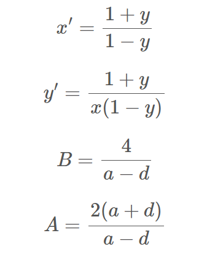
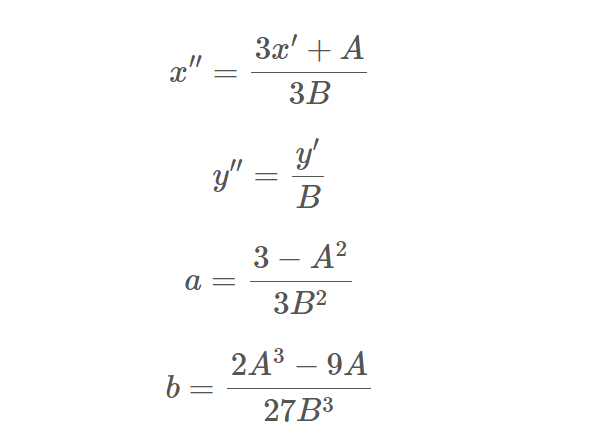
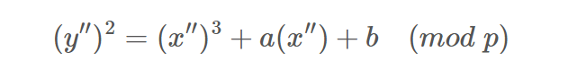

# Curve题解
## 解答
题目：
```python
#sagemath
from Crypto.Util.number import *

def add(P, Q):
    (x1, y1) = P
    (x2, y2) = Q

    x3 = (x1*y2 + y1*x2) * inverse(1 + d*x1*x2*y1*y2, p) % p
    y3 = (y1*y2 - a*x1*x2) * inverse(1 - d*x1*x2*y1*y2, p) % p
    return (x3, y3)

def mul(x, P):
    Q = (0, 1)
    while x > 0:
        if x % 2 == 1:
            Q = add(Q, P)
        P = add(P, P)
        x = x >> 1
    return Q

p = 64141017538026690847507665744072764126523219720088055136531450296140542176327
a = 362
d = 7
e=0x10001

gx=bytes_to_long(b'D0g3xGC{*****************}')

PR.<y>=PolynomialRing(Zmod(p))
f=(d*gx^2-1)*y^2+(1-a*gx^2)
gy=int(f.roots()[0][0])

assert (a*gx^2+gy^2)%p==(1+d*gx^2*gy^2)%p

G=(gx,gy)

eG = mul(e, G)
print(eG)

#eG = (34120664973166619886120801966861368419497948422807175421202190709822232354059, 11301243831592615312624457443883283529467532390028216735072818875052648928463)
```

曲线形式是标准型的扭曲爱德华曲线(Twisted Edwards Curves)：
> assert (a*gx^2+gy^2)%p==(1+d*gx^2*gy^2)%p

而仔细核对一下点加与点乘，发现都是完全对的上的。因此问题就转化为，已知Edcurve上的一个e倍点，求解该e倍点对应的原点G的横坐标，即为flag。

想一想，如果这是一条常见形式的椭圆曲线，求解方式是什么？步骤如下：
- 用sage中的order()函数求解出该椭圆曲线的阶n
- 求出e关于阶n的逆元，记为t
- 求倍点G=t*(eG)，横坐标即为所求

那么再回头，这个求解过程对于Edcurve肯定也是类似的，不过问题就在于，sage中没有办法直接求出Edcurve这种形式的曲线的阶，因此确定思路：
- 将Edcurve通过换元映射，变换为常见的椭圆曲线的形式
- 求解出对应椭圆曲线的阶，记为s
- 求倍点G’ = s*(eG’)
- 将求解出的G’再变换回Edcurve上得到G，其横坐标即为所求

因此难点就在于如何通过换元进行曲线映射，这里陈述一下换元过程：(以下除法均为有限域上除法，即乘逆元)。
- 第一步 转化为蒙哥马利曲线方程(Montgomery)：

- 第二步 转化为椭圆曲线方程(Weierstrass)：


此时蒙哥马利曲线就变成了椭圆曲线方程形式：


然后求该曲线的阶，从而求解出远原点G，并且重新逆变换回Edcurve，得到的横坐标即为flag。
wp:
```python
from Crypto.Util.number import *
p = 64141017538026690847507665744072764126523219720088055136531450296140542176327
a = 362
d = 7
c = 1
e = 0x10001
eG = (34120664973166619886120801966861368419497948422807175421202190709822232354059, 11301243831592615312624457443883283529467532390028216735072818875052648928463)

#part2 map to ECC
F = GF(p)
dd = F(d*c^4)
A = F(2) * F(a+dd) / F(a-dd)
B = F(4) / F(a-dd)
a = F(3-A^2) / F(3*B^2)
b = F(2*A^3-9*A) / F(27*B^3)

def edwards_to_ECC(x,y):
    x1 = F(x) / F(c)
    y1 = F(y) / F(c)
    #now curve is a*x^2+y^2 = 1+dd*x^2*y^2

    x2 = F(1+y1) / F(1-y1)
    y2 = F(x2) / F(x1)
    #now curve is By^2 = x^3 + Ax^2 + x

    x3 = (F(3*x2) + F(A)) / F(3*B)
    y3 = F(y2) / F(B)
    #now curve is y^2 = x^3 + ax + b

    return (x3,y3)
 
def ECC_to_edwards(x,y):
    x2 = (F(x) * F(3*B) - F(A)) / F(3)
    y2 = F(y) * F(B)
    #now curve is By^2 = x^3 + Ax^2 + x

    x1 = F(x2) / F(y2)
    y1 = F(1) - (F(2) / F(x2+1))
    #now curve is a*x^2+y^2 = 1+dd*x^2*y^2

    x_ = F(x1) * F(c)
    y_ = F(y1) * F(c)
    #now curve is a*x^2+y^2 = c^2(1+d*x^2*y^2)
    
    return (x_,y_)
 
E = EllipticCurve(GF(p), [a, b])
order = E.order()
eG = E(edwards_to_ECC(eG[0],eG[1]))
t = inverse(e,order)
G = t*eG
G = ECC_to_edwards(G[0],G[1])
print(long_to_bytes(int(G[0])))
```

(参考：[糖醋小鸡快](https://tangcuxiaojikuai.xyz/post/187210a7.html))