# 谍影重重5.0题解(_未做出_)
## 考点
* SMB协议数据解密
> 重要重要重要参考资料\
[Decrypting SMB3 Traffic with just a PCAP? Absolutely (maybe.)
](https://medium.com/maverislabs/decrypting-smb3-traffic-with-just-a-pcap-absolutely-maybe-712ed23ff6a2)\
[SMB Decryption - TryHackMe](https://malwarelab.eu/posts/tryhackme-smb-decryption/#method-1-decrypting-smb-with-the-password)\
> wp参考：\
[2024 强网杯 谍影重重5.0 超详解
](https://xz.aliyun.com/t/16100?time__1311=GuD%3D7KiK0KYKAKDsD7%2B%3D0%3DfW%2F%2FIHGCUjeD)\
[强网杯 谍影重重5.0 WP
](https://www.ctfiot.com/213700.html)
## 解答
> 关于SMB和NTLM协议参考： \
[SMB流量分析
](https://blog.csdn.net/qq_30464257/article/details/142205308)\
[Windows协议之NTLM
](https://www.cnblogs.com/yuy0ung/articles/18223233)

打开流量包，可以看到大量的SMB协议流量，并且均为加密传输：
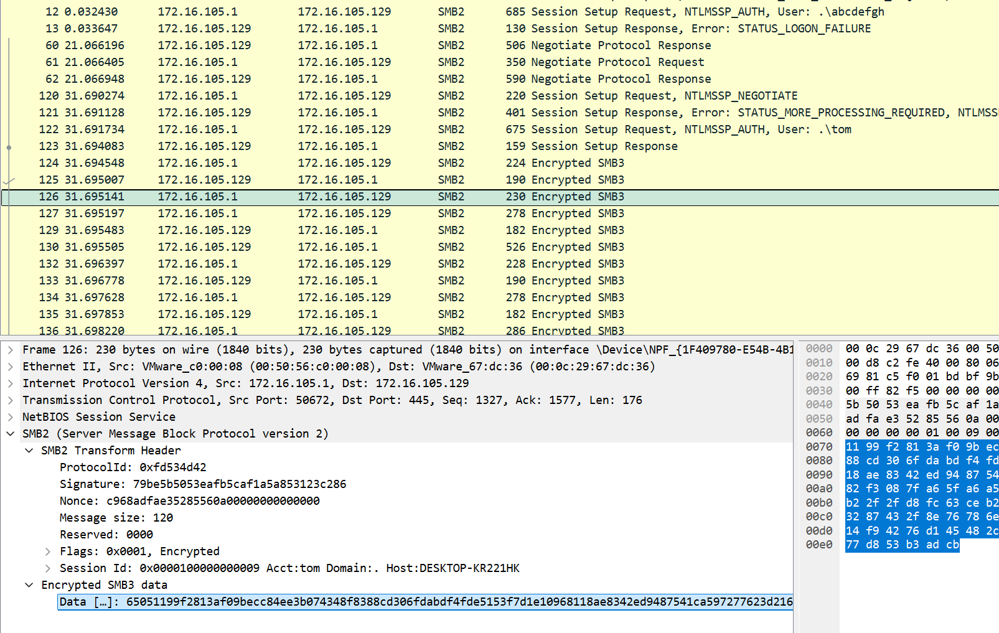

因此，如果想看到原始数据，就需要先解密SMB2：
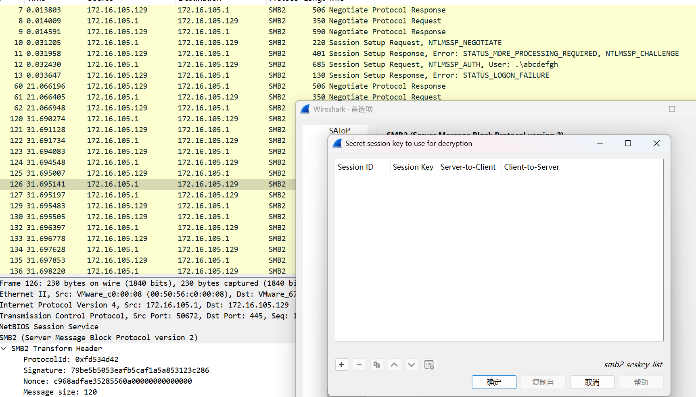

那么解密就必须要获得Session Key，那么问题就转换成了如何获得Session Key呢(也许可能从下面这个包里拿到Session Key，但是填到上面的配置中发现，依旧无法解密，原因是这个Session Key是Encrypted)？
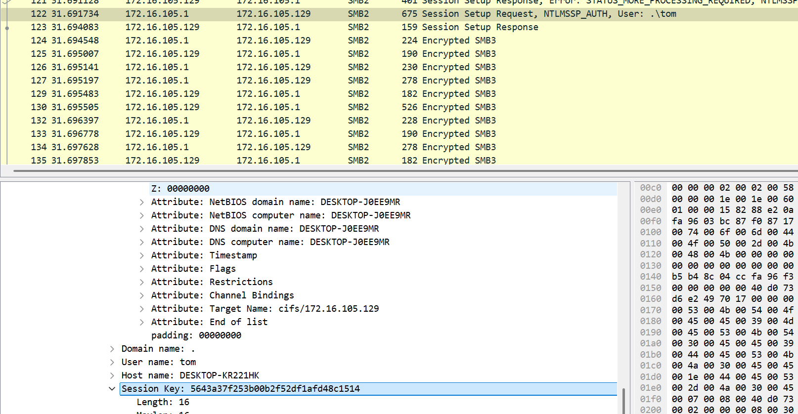

计算真正的Session Key参考如下这篇文章，写的很详细：
> [Decrypting SMB3 Traffic with just a PCAP? Absolutely (maybe.)
](https://medium.com/maverislabs/decrypting-smb3-traffic-with-just-a-pcap-absolutely-maybe-712ed23ff6a2)\
需要的数据如下：\
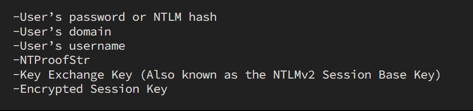
Session Key计算步骤简要概括如下：\
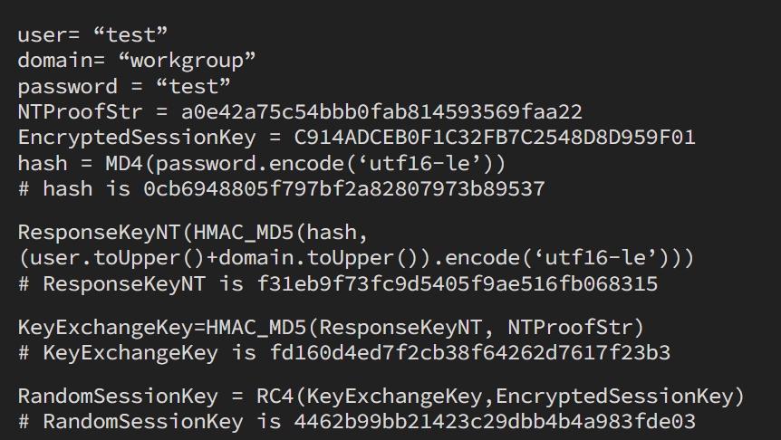

对于上述所需数据及计算步骤，我们可在pcap中找到`user`、`domain`、`NTProofStr`、`Encrypted Session Key`，而`Key Exchange Key`可以算出来，但现在的问题是`password`怎么计算呢？这一问题需要采用如下方式来解决：
> 拼接模式：username::domain:NTLM_Server_challenge:NTProofStr:ntlmssp.ntlmv2_response-NTProofStr\
\
tom::.:c1dec53240124487:ca32f9b5b48c04ccfa96f35213d63d75:010100000000000040d0731fb92adb01221434d6e24970170000000002001e004400450053004b0054004f0050002d004a0030004500450039004d00520001001e004400450053004b0054004f0050002d004a0030004500450039004d00520004001e004400450053004b0054004f0050002d004a0030004500450039004d00520003001e004400450053004b0054004f0050002d004a0030004500450039004d0052000700080040d0731fb92adb0106000400020000000800300030000000000000000100000000200000bd69d88e01f6425e6c1d7f796d55f11bd4bdcb27c845c6ebfac35b8a3acc42c20a001000000000000000000000000000000000000900260063006900660073002f003100370032002e00310036002e003100300035002e003100320039000000000000000000

然后将上述hash数据利用hashcat进行破解，<mark>**得到password为babygirl233**</mark>(`hashcat.exe -m 5600 crackme.txt rockyou.txt`)：
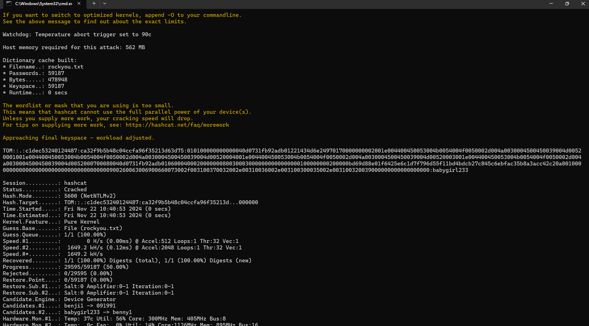


有了password后，根据上述【Session Key计算步骤】就可以<mark>**计算Session Key**</mark>了(结果为`a3abe4d64394909a641062342ffe291b`)，脚本（[random_session_key_calc.py](https://gist.github.com/khr0x40sh/747de1195bbe19f752e5f02dc22fce01#file-random_session_key_calc-py)）如下：
```python
import hashlib
import hmac
import argparse

#stolen from impacket. Thank you all for your wonderful contributions to the community
try:
    from Cryptodome.Cipher import ARC4
    from Cryptodome.Cipher import DES
    from Cryptodome.Hash import MD4
except Exception:
    LOG.critical("Warning: You don't have any crypto installed. You need pycryptodomex")
    LOG.critical("See https://pypi.org/project/pycryptodomex/")

def generateEncryptedSessionKey(keyExchangeKey, exportedSessionKey):
   cipher = ARC4.new(keyExchangeKey)
   cipher_encrypt = cipher.encrypt

   sessionKey = cipher_encrypt(exportedSessionKey)
   return sessionKey
###

parser = argparse.ArgumentParser(description="Calculate the Random Session Key based on data from a PCAP (maybe).")
parser.add_argument("-u","--user",required=True,help="User name")
parser.add_argument("-d","--domain",required=True, help="Domain name")
parser.add_argument("-p","--password",required=True,help="Password of User")
parser.add_argument("-n","--ntproofstr",required=True,help="NTProofStr. This can be found in PCAP (provide Hex Stream)")
parser.add_argument("-k","--key",required=True,help="Encrypted Session Key. This can be found in PCAP (provide Hex Stream)")
parser.add_argument("-v", "--verbose", action="store_true", help="increase output verbosity")

args = parser.parse_args()

#Upper Case User and Domain
user = str(args.user).upper().encode('utf-16le')
domain = str(args.domain).upper().encode('utf-16le')

#Create 'NTLM' Hash of password
passw = args.password.encode('utf-16le')
hash1 = hashlib.new('md4', passw)
password = hash1.digest()

#Calculate the ResponseNTKey
h = hmac.new(password, digestmod=hashlib.md5)
h.update(user+domain)
respNTKey = h.digest()

#Use NTProofSTR and ResponseNTKey to calculate Key Excahnge Key
NTproofStr = args.ntproofstr.decode('hex')
h = hmac.new(respNTKey, digestmod=hashlib.md5)
h.update(NTproofStr)
KeyExchKey = h.digest()

#Calculate the Random Session Key by decrypting Encrypted Session Key with Key Exchange Key via RC4
RsessKey = generateEncryptedSessionKey(KeyExchKey,args.key.decode('hex'))

if args.verbose:
    print "USER WORK: " + user + "" + domain
    print "PASS HASH: " + password.encode('hex')
    print "RESP NT:   " + respNTKey.encode('hex')
    print "NT PROOF:  " + NTproofStr.encode('hex')
    print "KeyExKey:  " + KeyExchKey.encode('hex')    
print "Random SK: " + RsessKey.encode('hex')
```
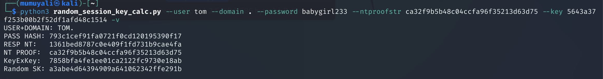

然后配置wireshark，可以发现自动解密了(<mark>注意，这里的配置可以有两种方式，一是输入password，二是通过配置smb2的sessionid和session key</mark>)：
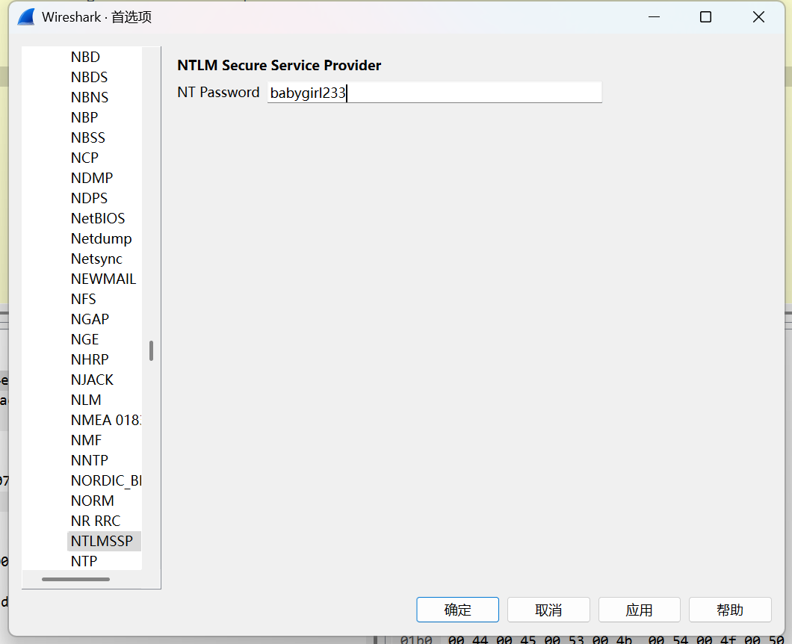
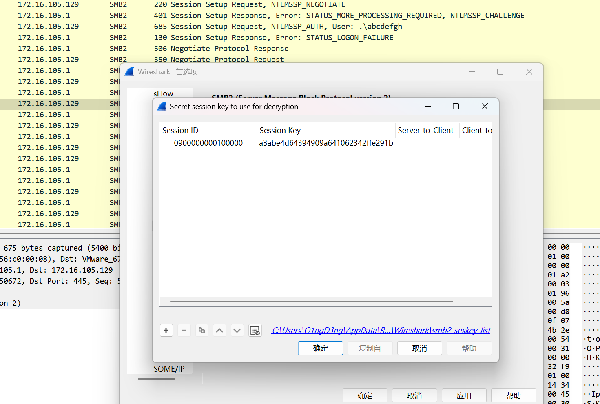
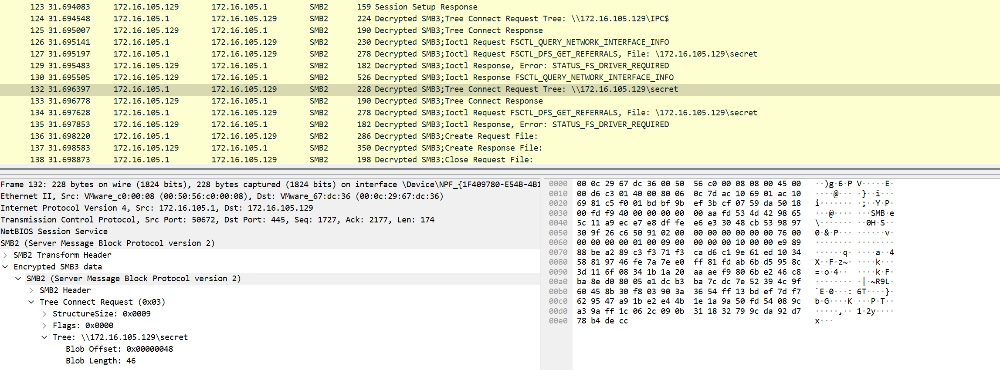

然后导出smb文件，<mark>**发现有一个flag.7z**</mark>：
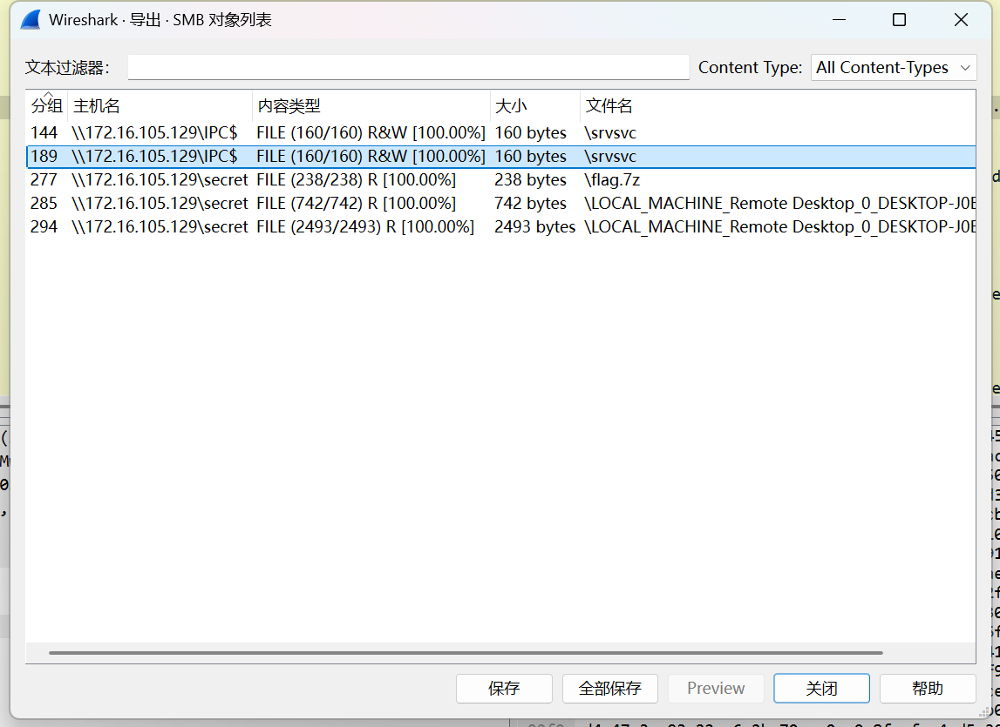


<mark>到这里，我们手里已经有了`password`、`session key`以及加密的`flag.7z`。因此，下面的认为就是如何解密flag.7z</mark>

再回过头看一下下载得到的文件，其中有两个证书文件，同时结合pcap包中的RDP流量和TLS，可以判断得到是用于加密远程桌面流量所使用的证书，那么可以先尝试把证书导入进去，那么先将`.pfx`文件转换为`.pem`文件，密码为mimikatz：
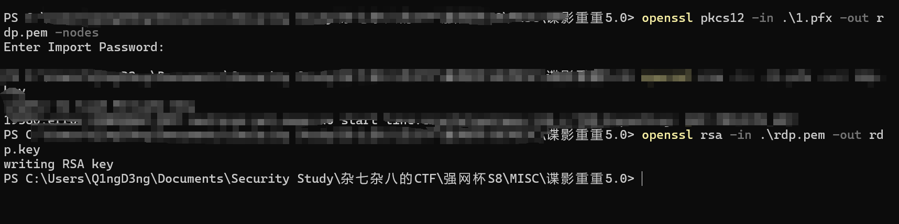
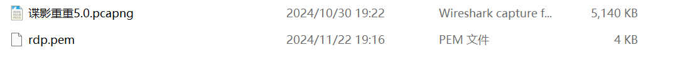
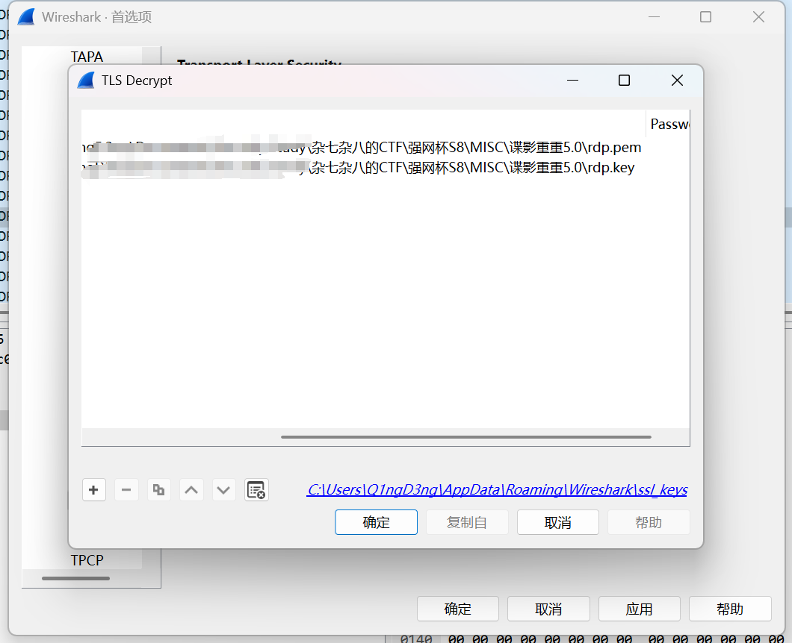

然后可以看到rdp流量了，可以看到传输的是大量的键盘和鼠标数据：
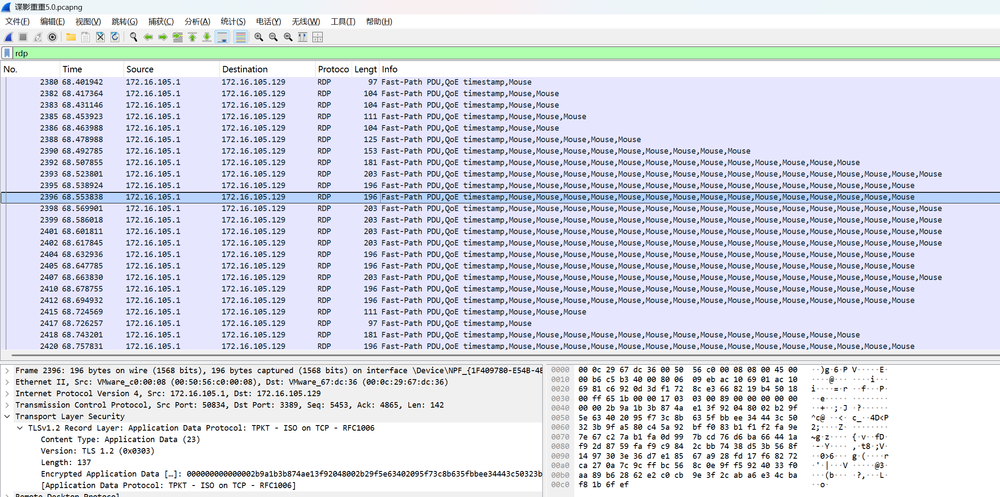

筛选`rdp.fastpath.scancode.keycode`可以得到如下传输的键盘数据结果，可以看到传输的应该是16禁止的ascii字符，我们需要将其导出为json，<mark>其中的keycode就是我们要转换的</mark>：
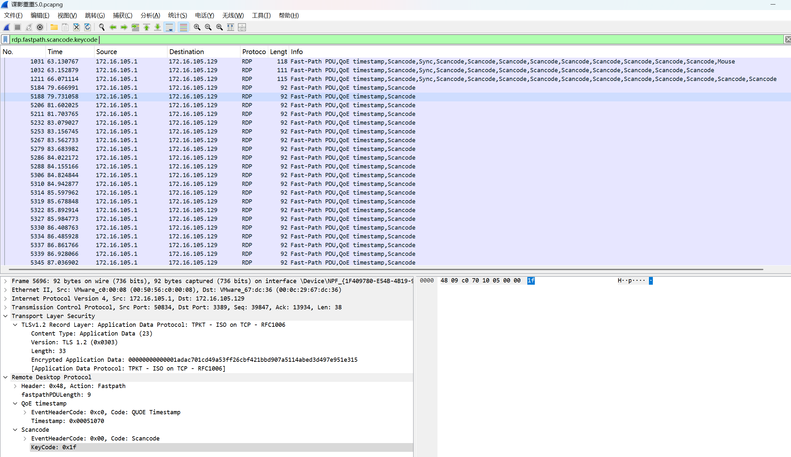
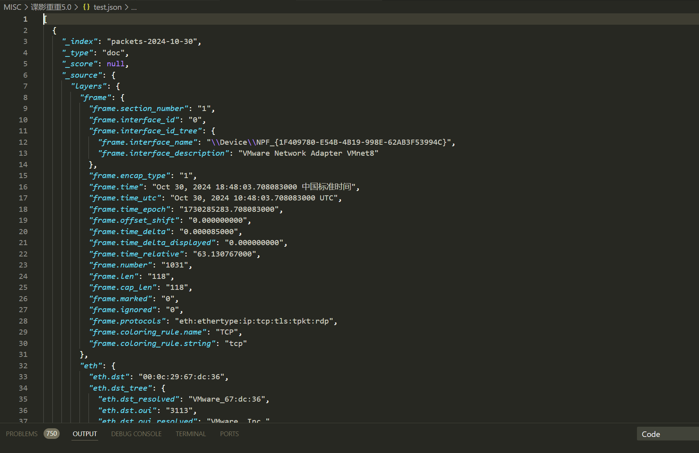

搞个脚本，来转换一下：
```python
def map_keycode(key_code):
    """根据扫描码返回相应的字符或描述"""
    # 特殊键的映射
    special_keys = {
        0x00: 'None',              # No key
        0x01: 'Esc',               # Esc
        0x02: '1',                 # 1
        0x03: '2',                 # 2
        0x04: '3',                 # 3
        0x05: '4',                 # 4
        0x06: '5',                 # 5
        0x07: '6',                 # 6
        0x08: '7',                 # 7
        0x09: '8',                 # 8
        0x0A: '9',                 # 9
        0x0B: '0',                 # 0
        0x0C: '-',                 # -
        0x0D: '=',                 # =
        0x0E: 'Backspace',         # Backspace
        0x0F: 'Tab',               # Tab
        0x10: 'Q',                 # Q
        0x11: 'W',                 # W
        0x12: 'E',                 # E
        0x13: 'R',                 # R
        0x14: 'T',                 # T
        0x15: 'Y',                 # Y
        0x16: 'U',                 # U
        0x17: 'I',                 # I
        0x18: 'O',                 # O
        0x19: 'P',                 # P
        0x1A: '[',                 # [
        0x1B: ']',                 # ]
        0x1C: 'Enter',             # Enter
        0x1D: 'Left Ctrl',         # Left Control
        0x1E: 'A',                 # A
        0x1F: 'S',                 # S
        0x20: 'D',                 # D
        0x21: 'F',                 # F
        0x22: 'G',                 # G
        0x23: 'H',                 # H
        0x24: 'J',                 # J
        0x25: 'K',                 # K
        0x26: 'L',                 # L
        0x27: ';',                 # ;
        0x28: "'",                 # '
        0x29: 'Grave',             # `
        0x2A: 'Left Shift',        # Left Shift
        0x2B: 'Backslash',         # \
        0x2C: 'Z',                 # Z
        0x2D: 'X',                 # X
        0x2E: 'C',                 # C
        0x2F: 'V',                 # V
        0x30: 'B',                 # B
        0x31: 'N',                 # N
        0x32: 'M',                 # M
        0x33: ',',                 # ,
        0x34: '.',                 # .
        0x35: '/',                 # /
        0x36: 'Right Shift',       # Right Shift
        0x37: 'Keypad *',          # Keypad *
        0x38: 'Alt',               # Alt
        0x39: 'Space',             # Space
        0x3A: 'Caps Lock',         # Caps Lock
        0x3B: 'F1',                # F1
        0x3C: 'F2',                # F2
        0x3D: 'F3',                # F3
        0x3E: 'F4',                # F4
        0x3F: 'F5',                # F5
        0x40: 'F6',                # F6
        0x41: 'F7',                # F7
        0x42: 'F8',                # F8
        0x43: 'F9',                # F9
        0x44: 'F10',               # F10
        0x45: 'F11',               # F11
        0x46: 'F12',               # F12
        0x47: 'Num Lock',          # Num Lock
        0x48: 'Keypad 7',          # Keypad 7
        0x49: 'Keypad 8',          # Keypad 8
        0x4A: 'Keypad 9',          # Keypad 9
        0x4B: 'Keypad -',          # Keypad -
        0x4C: 'Keypad 4',          # Keypad 4
        0x4D: 'Keypad 5',          # Keypad 5
        0x4E: 'Keypad 6',          # Keypad 6
        0x4F: 'Keypad +',          # Keypad +
        0x50: 'Keypad 1',          # Keypad 1
        0x51: 'Keypad 2',          # Keypad 2
        0x52: 'Keypad 3',          # Keypad 3
        0x53: 'Keypad 0',          # Keypad 0
        0x54: 'Keypad .',          # Keypad .
        0x5B: 'Left Win',          # Left Windows
        0x5C: 'Right Win',         # Right Windows
        0x5D: 'Menu',              # Menu
        0x5E: 'Right Ctrl',        # Right Control
        0x5F: 'Right Alt',         # Right Alt
    }

    return special_keys.get(key_code, f"Unknown key code: {key_code}")

def process_keyboard_data(data):
    """处理键盘输入数据，返回对应的按键描述"""
    output = []
    for entry in data:
        # 分割扫描码并转换为整数
        key_codes = entry.split(',')
        mapped_keys = [map_keycode(int(code, 16)) for code in key_codes]
        output.append(' '.join(mapped_keys))
    return output

# 示例键盘输入数据
keyboard_data = [
    "0x0f,0x2a,0x36,0x1d,0x1d,0x0f,0x38,0x0f,0x38,0x0f",
    "0x0f,0x2a,0x36,0x1d,0x1d,0x0f,0x38,0x0f,0x38,0x0f",
    "0x0f,0x5b,0x5c,0x2a,0x36,0x1d,0x1d,0x0f,0x38,0x0f,0x38,0x0f",
    "0x14",
    "0x23",
    "0x12",
    "0x2a",
    "0x39",
    "0x08",
    "0x2c",
    "0x39",
    "0x19",
    "0x1e",
    "0x1f",
    "0x1f",
    "0x11",
    "0x18",
    "0x13",
    "0x20",
    "0x39",
    "0x17",
    "0x1f",
    "0x39",
    "0x21",
    "0x28",
    "0x1a",
    "0x2a",
    "0x11",
    "0x17",
    "0x31",
    "0x20",
    "0x18",
    "0x11",
    "0x1f",
    "0x0c",
    "0x2a",
    "0x19",
    "0x1e",
    "0x1f",
    "0x1f",
    "0x11",
    "0x18",
    "0x13",
    "0x20",
    "0x1b",
    "0x2a",
    "0x0a",
    "0x04",
    "0x05",
    "0x08",
    "0x0b",
    "0x02",
    "0x04",
    "0x02",
    "0x09",
    "0x03",
    "0x28",
    "0x1f",
    "0x1d",
    "0x0f,0x2a,0x36,0x1d,0x1d,0x0f,0x38,0x0f,0x38,0x0f"
]

# 处理每行数据
keycode = process_keyboard_data(keyboard_data)

# 将结果写入文本文件
with open('keycode.txt', 'w') as file:
    for entry in keycode:
        file.write(entry + '\n')
```
可以看到得到如下关键信息，即`THE 7z PASSWORD IS F{WINDOWS_PASSWORD}9347013182`：
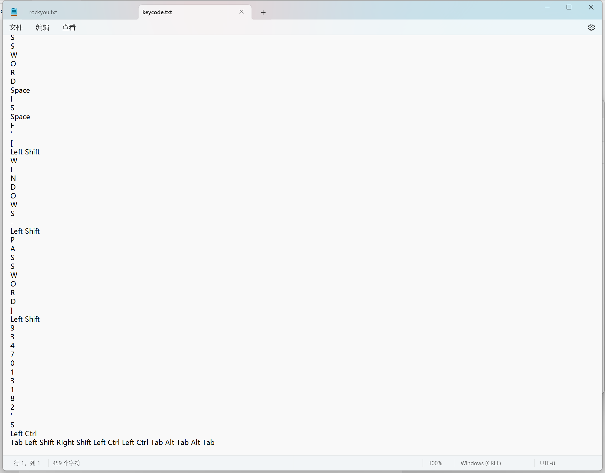

因此，解密flag.7z的密码应为`babygirl2339347013182`：
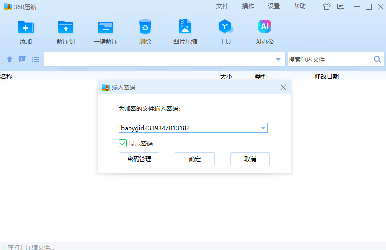 
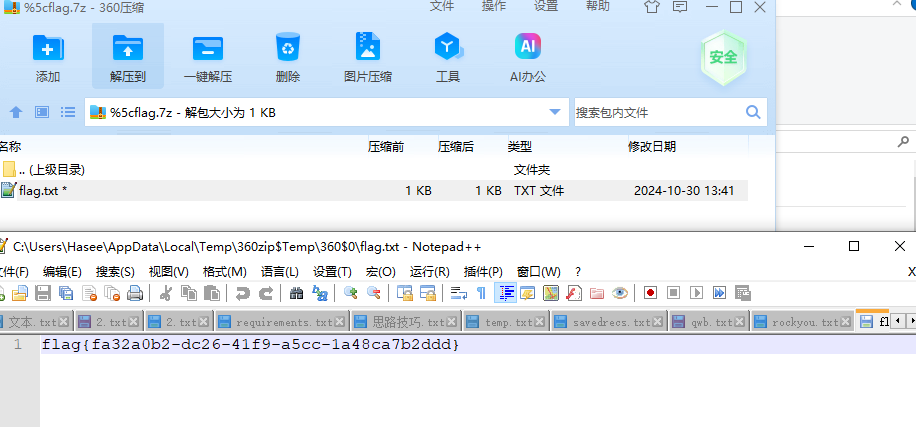