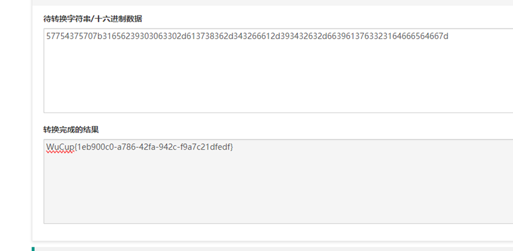

# 旋转木马题解
## 分析与解答
这道题刚开始的时候以为需要用010editor去找一些隐藏内容，但是结合题目以及文件内容，猜测可能是多次base64编码，于是将Flag1+flag2拼接，然后53次base64解码：
```python
import base64
import binascii

# 读取flag.txt文件内容
with open('flag.txt', 'rb') as file:
    content = file.read()

# 初始化解码结果为原始内容
decoded_content = content

# 对内容进行53次Base64解码
for _ in range(53):
    # 将内容解码为Base64
    decoded_content = base64.b64decode(decoded_content)

# 将解码后的结果转换为16进制字符串
hex_str = binascii.hexlify(decoded_content).decode('utf-8')

# 输出16进制字符串对应的字符
try:
    output = bytes.fromhex(hex_str).decode('utf-8')
    print(output)
except ValueError as e:
print(f"解码过程中发生错误：{e}")

#57754375707b31656239303063302d613738362d343266612d393432632d6639613763323164666564667d
```
然后将上述输出结果转换为字符串：
